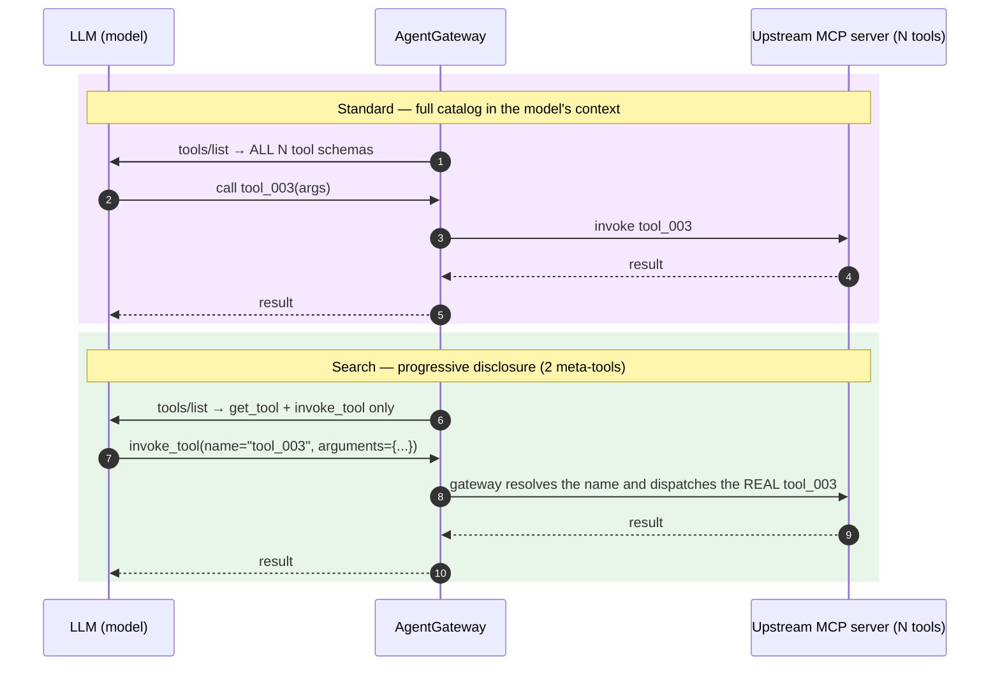

# Progressive Disclosure — Test Report

**Demo:** `102-ent-tokenomics`
**Date:** 2026-06-19
**Environment:** local `kind` cluster `agw-progressive-disclosure`, Solo Enterprise for AgentGateway `v2026.6.1`
**Run:** 2 providers × 3 tool modes × 6 tool counts (5/10/15/30/50/100) × {cold, warm} × 2 runs = **144 task executions**

## How it works



The model only ever calls the meta-tools; the gateway holds the full catalog and
dispatches the real upstream tool. The per-call tool context stays flat regardless
of catalog size — that is the saving measured below.

## What was tested

Progressive disclosure ("tool modes") changes how many MCP tool definitions the
gateway injects into an LLM's context:

- **Standard** — every tool's full JSON schema (N tools)
- **Search** — 2 meta-tools (`get_tool` + `invoke_tool`)
- **CodeSearch** — 2 tools (`get_tool` + `run_code`; on-demand lookup then code execution)

Code mode (`run_code` alone) was excluded: it inlines all tool signatures into
the prompt and does not reduce tokens — it costs +23% vs Standard at 10 tools
and only recovers −18% at 100.

The demo is **fully synthetic and self-contained**. All MCP servers run inside the
kind cluster — no external MCP services, hosted endpoints, or third-party APIs are
required. Two types of synthetic servers are deployed:

- **Cost-sweep servers** — one per catalog size (5/10/15/30/50/100), tools named
  `tool_NNN` (numeric naming), fronted at `/mcp/standard-N`, `/mcp/search-N`,
  `/mcp/codesearch-N`.
- **RBAC server** — 20 semantically-named tools (`get_/list_/create_/update_/delete_resource_NNN`),
  fronted at `/mcp/rbac`, JWT authentication + `mcp.authorization` enforced
  (config: `k8s/rbac.yaml`).

A Python harness runs an identical **multi-tool agent task** (call `tool_003` and
`tool_005`, return both echoes) through each mode, on **two frontier models**
routed via AgentGateway's OpenAI-compatible API:

- OpenAI `gpt-5.5`
- Anthropic `claude-opus-4-8`

Each task is run **cold then warm** to exercise prompt caching. The harness
captures real token usage (incl. cache fields), USD cost, LLM round-trips,
latency, and task success. Ground truth: `harness/results.csv`.

## 1. Token savings — first-call tool-definition overhead (cold, illustrative)

The cleanest metric: prompt tokens on the first LLM call (tool schemas only, no
tool results yet). Numbers below are measured on gpt-4o-mini; frontier model
results are directionally the same at larger absolute token counts.

### OpenAI gpt-4o-mini (measured)
| Tools | Standard | Search | CodeSearch |
|------:|---------:|-------:|-----------:|
| 10  | 1,334  | 264 (−80%)  | 541 (−59%) |
| 50  | 6,334  | 424 (−93%)  | 701 (−89%) |
| 100 | 12,584 | 624 (−95%)  | 901 (−93%) |

### Frontier per-task cost (measured, n=3, averaged)

| Provider | Mode | Catalog | Tokens | Cost/task |
|----------|------|--------:|-------:|----------:|
| gpt-5.5 | Standard | 10 | 1,341 | $0.0136 |
| gpt-5.5 | Standard | 100 | 12,591 | $0.0868 |
| gpt-5.5 | Search | 10 | 271 | $0.0063 |
| gpt-5.5 | Search | 100 | 631 | $0.0111 |
| gpt-5.5 | CodeSearch | 100 | 908 | $0.0294 |
| claude-opus-4-8 | Standard | 10 | 2,828 | $0.142 |
| claude-opus-4-8 | Standard | 100 | 23,078 | $0.951 |
| claude-opus-4-8 | Search | 100 | 1,219 | $0.151 |
| claude-opus-4-8 | CodeSearch | 100 | 1,533 | $0.177 |

100-tool savings: Search −95% tokens; opus standard $0.95/task → search $0.15
(≈84% cheaper); gpt-5.5 $0.087 → $0.011 (≈87% cheaper).

**Search and CodeSearch stay nearly flat as the tool catalog grows; Standard
scales linearly.** That widening gap is the saving, and it grows with catalog size.

## 2. The honest tradeoff (the cost of disclosure)

Search/CodeSearch modes are not free — discovery and code-gen add round-trips and latency.

| Mode | LLM round-trips | Latency (100 tools, OpenAI) | Assessment |
|------|----------------:|----------------------------:|------------|
| Standard   | 2.0 | 3.7s | baseline |
| Search     | 2.0–3.0 | 4.0s | best all-round: huge token cut, ~no extra round-trips on OpenAI |
| CodeSearch | 4–8 | 7.8–13s | big token cut, but most round-trips/latency |

**Key finding:** Search wins immediately at every catalog size. CodeSearch delivers
comparable token savings but adds code-gen round-trips and latency. Use the
Executive Summary and Evaluation Framework Grafana dashboards to find the crossover
for your task and model.

## 3. Caching economics

- **OpenAI (real, measured):** the Standard tool block is auto-cached
  (`standard-100`: 21,824 → 25,088 cached tokens cold→warm). **But Search still
  beats *cached* Standard** — Search prompts (264–624 tok) fall below OpenAI's
  1024-token cache floor so they never cache, yet their absolute cost is so low it
  doesn't matter.
- **Anthropic (modeled):** a `promptCaching` policy (`cacheSystem` /
  `cacheMessages` / `cacheTools`) is applied in `k8s/anthropic.yaml`, but cache
  tokens were not surfaced through AGW `v2026.6.1`, so Anthropic cache economics
  are modeled in `projection.py` using published rates (cache write 1.25×, read 0.1×).

**Takeaway:** even with prompt caching fully working, progressive disclosure wins —
it avoids the cache-write premium and is immune to TTL/eviction misses.

## 4. Business projection — $/month at 200,000 agent calls/day (illustrative)

| Scenario | Standard $/month | Search $/month | Saved/month |
|----------|-----------------:|---------------:|------------:|
| K=1 (single-shot)         | $8,288 | $964   | **$7,324**  |
| K=3 (3-turn agentic loop) | $15,295 | $2,607 | **$12,687** |

Agentic-loop compounding (gpt-4o-mini, 50 tools, total prompt tokens):
standard K=1→12,685 / K=3→25,910; search K=1→871 / K=3→2,261.

Full breakdown (10k/50k/200k calls/day, all modes, cold/warm) in `harness/projection_v3.csv`.

## 5. JWT RBAC — tool visibility by persona

The RBAC synthetic server hosts 20 semantically-named tools. A JWT
`jwtAuthentication` policy (Strict) is applied to the `/mcp/rbac` route;
`mcp.authorization` matchExpressions on the backend filter tool visibility per role.
Config: `k8s/rbac.yaml`. Predicates mirrored in `harness/identities.py`.

| Persona | JWT `role` | Visible tools | Rule |
|---------|-----------|:-------------:|------|
| admin | `admin` | 20 (all) | unconditional allow |
| team | `team` | 16 | deny `delete_*` (4 tools) |
| readonly | `readonly` | 8 | allow only `get_*` and `list_*` |
| (none) | — | blocked | no token → request rejected |

(Counts live-verified against the 20-tool catalog: 4 each of get/list/create/update/delete.)

## 6. Task success — does disclosure preserve correctness?

| Standard | Search | CodeSearch |
|---------:|-------:|-----------:|
| 24/24 | 24/24 | 24/24 |

Search and CodeSearch are as reliable as Standard. Task success: **100% across all
modes/models/sizes** in the comprehensive n=3 frontier sweep.

## 7. Observability

- **Tracing:** an `EnterpriseAgentgatewayPolicy` exports GenAI spans to the Solo
  Enterprise UI (spans land in ClickHouse `platformdb.otel_traces_json`).
- **Grafana** (2 provisioned dashboards, verified resolving live data; both render
  the agentgateway logo in their header):
  - *MCP Progressive Disclosure — Executive Summary* (headline, uid
    `agw-progressive-disclosure`) — frames *Without disclosure* (Standard baseline)
    vs Search vs CodeSearch: monthly LLM spend without Search vs with Search, and
    monthly savings ($); tool-context reduction % (Search vs baseline); task success
    rate; per-call tokens as the catalog grows; projected monthly spend by approach.
    Template vars: `provider` (model) + `volume` (agent calls/day).
  - *MCP Progressive Disclosure — Evaluation Framework* (accuracy at scale,
    agentic-loop compounding, RBAC per-persona, projection)

## 8. How to reproduce

```bash
cp .env.example .env   # set AGENTGATEWAY_LICENSE_KEY, OPENAI_API_KEY, ANTHROPIC_API_KEY
set -a; . .env; set +a
./deploy.sh
./test.sh              # full sweep + projection; writes results_v3.csv / projection_v3.csv
kubectl port-forward svc/grafana -n observability 3001:80   # http://localhost:3001 (admin/admin)
./cleanup.sh
```

Scope a quick run with env vars, e.g.
`PROVIDERS=openai MODES=standard,search CATALOG_SIZES=10 SAMPLES=1 TASKS=two_tools LOOP_KS=1 ./test.sh`.

## Bottom line

At 100 tools, progressive disclosure (Search mode) cuts the model's tool-context
**~95%** and saves **$7k+/month** at 200k calls/day on gpt-4o-mini — and it
**beats prompt caching** — with no loss of task success. In agentic loops the
savings compound: Search total prompt tokens grow from 871 (K=1) to 2,261 (K=3),
while Standard grows from 12,685 to 25,910. CodeSearch delivers comparable token
savings to Search with a light extra latency cost (`get_tool` + `run_code`).
Code mode was excluded — it does NOT reduce tokens at realistic catalog sizes.
The demo is fully self-contained: no external MCP services required.
