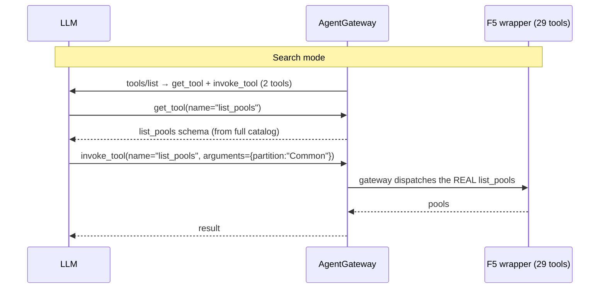

# 103 — F5 MCP Tool Modes (Search & Code)

Front a **real F5 BIG-IP MCP server** with AgentGateway and ask an LLM questions
about your F5 — through each [MCP tool mode](https://docs.solo.io/agentgateway/latest/mcp/tool-mode/).
You watch exactly which tools the model calls and what it costs in tokens.

The F5 wrapper exposes **29 LTM tools** (`list_pools`, `get_virtual_server`,
`failover_status`, …). The question this demo answers: *does progressive
disclosure (Search/Code mode) shrink the per-call context vs sending all 29?*

## Tool modes (all three deployed in front of the same F5)

| Mode | `toolMode` | Tools the model sees | How it works |
|------|-----------|:--------------------:|--------------|
| **Standard** | `Standard` | 29 (all) | Full F5 catalog injected every call; model calls tools directly |
| **Search** | `Search` | 2 | `get_tool` + `invoke_tool`; model discovers a tool by name, then invokes it — gateway dispatches the real F5 tool |
| **Code** | `Code` | 1 | `run_code`; model writes JavaScript that calls F5 tools in a sandbox (`codeMode.timeout`); only the final result returns |



## Measured on a real BIG-IP (gpt-4o-mini, "list the pools")

| Mode | Tools advertised | First-call tool tokens | Cost/task |
|------|-----------------:|-----------------------:|----------:|
| Standard | 29 | 1,518 | $0.000808 |
| **Search** | 2 | **301 (−80%)** | **$0.000501 (−38%)** |

Search cuts the per-call tool context ~80%. Code mode keeps context tiny too and
collapses multi-step work into one sandboxed script — it rewards a stronger model
(gpt-5.5 ran it cleanly in 2 calls; gpt-4o-mini fumbled the JS API).

## Prerequisites

`kind`, `kubectl`, `helm`, `docker`, `git`, `python3` (≥ 3.10). Env vars:

| Variable | Purpose |
|----------|---------|
| `AGENTGATEWAY_LICENSE_KEY` | Solo Enterprise license |
| `OPENAI_API_KEY` | LLM via the `/openai` gateway route |
| `F5_HOST` / `F5_USERNAME` / `F5_PASSWORD` | the F5 BIG-IP the wrapper manages |

## Quick start

```bash
cp .env.example .env        # fill in the keys + F5_PASSWORD
set -a; . .env; set +a
./deploy.sh                 # kind + AGW + OpenAI backend + F5 (std/search/code)
./test.sh                   # asks one question through all 3 modes, shows tokens
```

### Ask your own questions (manual, interactive)

```bash
kubectl port-forward deployment/agentgateway-proxy -n agentgateway-system 8080:80 &
cd harness
./.venv/bin/python f5_chat.py search      # then type questions; 'quit' to exit
./.venv/bin/python f5_chat.py code
./.venv/bin/python f5_chat.py standard    # for contrast
```
Try: *"How many LTM pools are there and list their names?"*, *"Show the virtual
servers and their pools"*, *"What's the BIG-IP version and failover status?"*.
For each turn you see the tool calls (`get_tool`/`invoke_tool` or `run_code`) and
a token line (`first-call tokens / total / cost`).

> **Code mode + model strength:** `run_code` makes the model write JavaScript. Use
> a strong model — point the `/openai` backend at `gpt-5.5` and run with
> `OPENAI_MODEL=gpt-5.5 ./test.sh` (the tooling omits `temperature` for gpt-5.x,
> which rejects non-default values).

### A/B the savings directly

```bash
./harness/.venv/bin/python harness/f5_savings.py    # standard vs search: tokens + $
```

## Cleanup

```bash
./cleanup.sh                # deletes the kind cluster
```

## Notes

- The F5 wrapper (`sebbycorp/k8s-iceman/apps/f5-wrapper`) is built locally because
  the published image is amd64-only; `deploy.sh` builds it for your node's arch.
- Runs **READ_ONLY** for demo safety. `F5_VERIFY_SSL=false` targets a lab device
  with a self-signed cert — set `true` + mount the device CA for production.
- Secrets come from the gitignored `.env`; manifests carry only `__PLACEHOLDER__`s.
