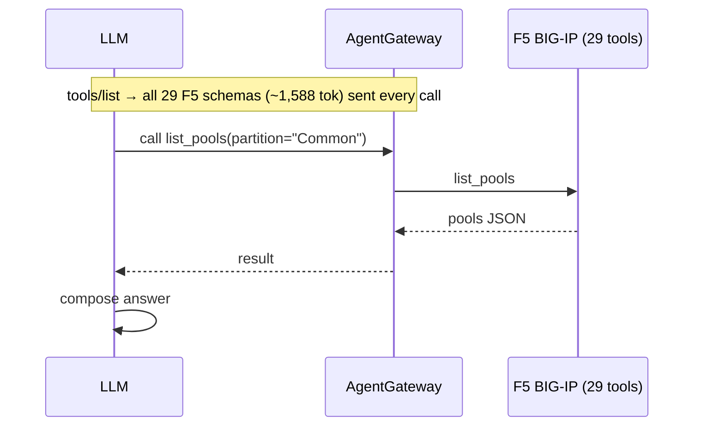
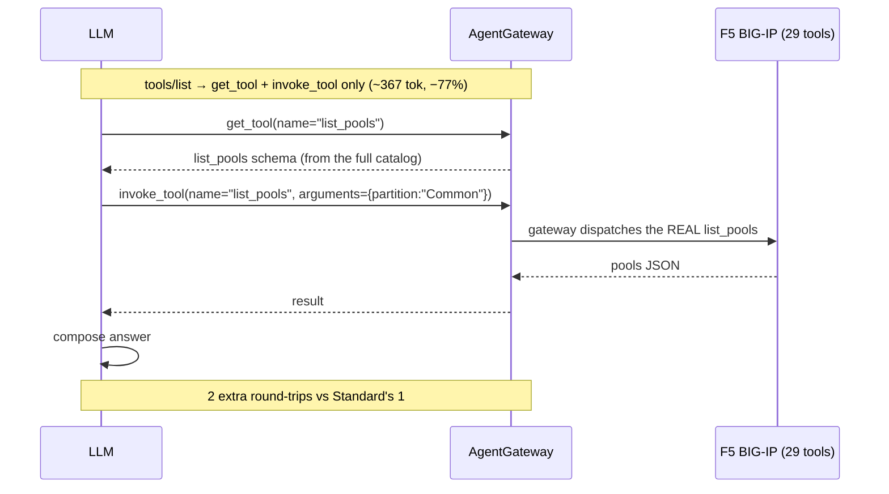
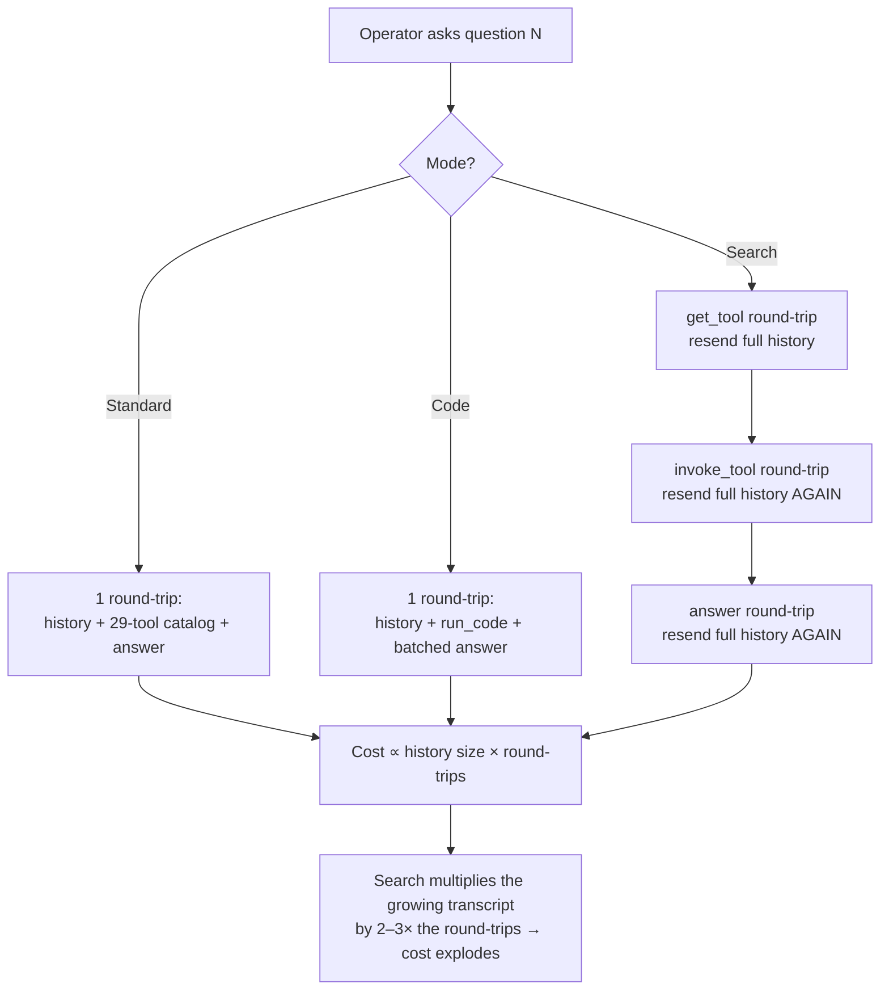
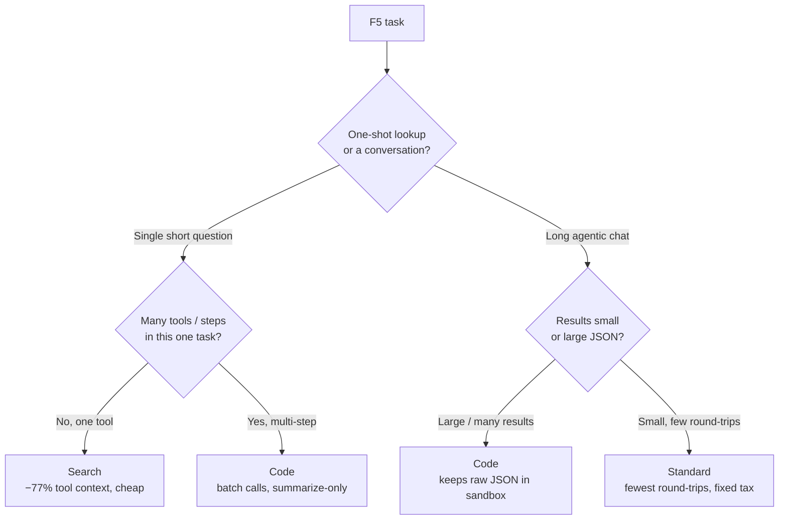

# 103 — F5 MCP Tool Modes (Search & Code): does progressive disclosure save money?

Front a **real F5 BIG-IP MCP server** with AgentGateway and ask an LLM operator
questions about your F5 — through each [MCP tool mode](https://docs.solo.io/agentgateway/latest/mcp/tool-mode/).
You watch *exactly* which tools the model calls, how many round-trips it takes, and
what each costs in tokens.

The F5 wrapper exposes **29 LTM tools** (`list_pools`, `get_virtual_server`,
`failover_status`, …). The question this demo answers with live numbers:

> **Do Search and Code mode actually save money — or just move the cost around?**

Short answer: **it depends on the shape of the work.** Search saves money on quick
one-shot lookups (smaller per-call context), but *costs ~5× more* in a long
multi-turn conversation (extra round-trips re-send the growing transcript). This
README walks the flows so you can see why.

---

## The three tool modes

All three are deployed in front of the **same** F5 wrapper. The only thing that
changes is *how many tools the model sees* and *how it reaches the real F5 tool*.

| Mode | `toolMode` | Tools the model sees | First-call tool context | How it works |
|------|-----------|:--------------------:|:----------------------:|--------------|
| **Standard** | `Standard` | **29** (all) | ~1,588 tok | Full F5 catalog injected every call; model calls tools directly |
| **Search** | `Search` | **2** | **~367 tok (−77%)** | `get_tool` + `invoke_tool`; model discovers a tool by name, then invokes it |
| **Code** | `Code` | **1** | ~1,939 tok (+22%) | `run_code`; model writes JS that calls F5 tools in a sandbox; only the final result returns |

> **Key nuance up front:** Search shrinks the *per-call tool schema* by 77%. Code
> does **not** — its single `run_code` tool inlines every F5 signature into its
> description, so its first-call context is actually the *largest*. Code's win is
> **batching** many tool calls into one script, not shrinking context.

---

## Flow 1 — Standard mode: all 29 tools, direct calls

The gateway injects the entire 29-tool catalog on every turn. The model picks a
tool and calls it directly. Fewest round-trips, but a fixed "catalog tax" each turn.



---

## Flow 2 — Search mode: 2 meta-tools, discover-then-invoke

The catalog collapses to **2 tools**. The model must first *discover* the tool it
wants (`get_tool`), then *invoke* it (`invoke_tool`). Tiny per-call context — but
**each discover/invoke is an extra LLM round-trip.**



---

## Flow 3 — Code mode: 1 tool, batch the whole workflow in one script

The model writes JavaScript that calls *several* F5 tools in one sandboxed
`run_code` execution. Many tool calls collapse into **one** LLM round-trip, and
only the final summarized result returns to the model (not every raw F5 JSON blob).

```mermaid
sequenceDiagram
    participant M as LLM
    participant G as AgentGateway
    participant S as run_code sandbox
    participant F as F5 BIG-IP (29 tools)
    Note over M,G: tools/list → run_code only (signatures inlined, ~1,939 tok)
    M->>G: run_code("const p = await list_pools(); const v = await list_virtuals(); return summarize(p,v)")
    G->>S: execute script
    S->>F: list_pools
    F-->>S: pools
    S->>F: list_virtuals
    F-->>S: virtuals
    S-->>G: final result only
    G-->>M: result
    M->>M: compose answer
    Note over M,S: N tool calls → 1 LLM round-trip; raw JSON stays in the sandbox
```

---

## The money story (measured live on a real BIG-IP, gpt-5.5)

### Part A — single, short question (fresh session): Search & Code win

One question, one fresh session. This is where progressive disclosure shines —
the smaller per-call context (Search) or the batching + summarize-only behavior
(Code) directly lowers cost.

| Question | Standard | Search | Code |
|----------|---------:|-------:|-----:|
| pools     | $0.04607 | $0.04005 | **$0.01340** |
| virtuals  | $0.01779 | $0.01544 | **$0.01317** |
| system    | $0.01256 | **$0.01075** | $0.02294 |
| failover  | $0.01716 | $0.00844 | **$0.01269** |
| certs     | $0.05163 | $0.05926 | **$0.01351** |
| **average** | **$0.0290** | **$0.0268** | **$0.0151** |

First-call tool context (deterministic): **Standard 1,588 · Search 367 (−77%) · Code 1,939.**

- **Search** is cheaper than Standard on simple lookups (up to ~50% on `failover`),
  because the tool schema it ships is 77% smaller. It can *lose* when the model
  chooses many `invoke_tool` round-trips (see `certs` — 6 calls).
- **Code** is the cheapest on average here: it batches calls and returns only the
  final summary, so big results (like `certs`) never bloat the model's context.

### Part B — a real operator conversation (5 questions deep): the story inverts

Operators don't ask one question — they have a *conversation*. Here history (and
every F5 JSON result) **accumulates**, and the gateway re-sends the tool defs every
turn. Cumulative cost after a 5-question chat:

| Turn | Standard | Search | Code |
|-----:|---------:|-------:|-----:|
| 1 | $0.0184 | $0.0472 | $0.0377 |
| 2 | $0.0637 | $0.3092 | $0.0910 |
| 3 | $0.1033 | $0.5103 | $0.1399 |
| 4 | $0.1725 | $0.8326 | $0.2214 |
| 5 | **$0.1975** | **$0.9426** | **$0.2473** |

| Mode | Total tokens | Cache-read tokens | Final cost | vs Standard |
|------|-------------:|------------------:|-----------:|------------:|
| **Standard** | 51,640 | 31,360 (61%) | **$0.197** | — |
| Code | 68,454 | 52,736 (77%) | $0.247 | +25% |
| **Search** | 286,075 | 226,816 (79%) | **$0.943** | **~4.8× more** |

**Search is now the most expensive — by almost 5×.** This is the headline insight.

### Flow 4 — *why* it inverts: round-trips re-send the transcript

The flat per-call tool saving (367 vs 1,588) is real but tiny next to the real
driver of conversation cost: **every extra round-trip re-processes the entire
accumulated history** — which in an F5 chat is full of large tool-result JSON.



Standard pays a fixed 29-tool tax once per turn but takes the **fewest** round-trips.
Code batches its tool calls into one `run_code` and lands in the middle. Search wins
the per-call-context battle and loses the round-trip war.

### Does caching rescue Search? No.

gpt-5.5 prompt caching is heavy in **every** mode (61–79% of prompt tokens served
from cache here, billed ~50% off). But caching only discounts the *input prefix* —
it never caches output, and Search emits far more output (its extra round-trips).
Even if cached tokens were **free**, Search still costs ~2.3× more in this 5-turn
chat. Caching softens the gap; it does not reverse it. (Full breakdown in
[`COST-ANALYSIS.md`](./COST-ANALYSIS.md).)

---

## Flow 5 — which mode should you pick?



| Workload | Winner | Why |
|----------|--------|-----|
| Single call / short task, large catalog | **Search** | ~77% smaller per-call tool context; ~18–50% cheaper |
| Multi-step workflow over many tools | **Code** | one `run_code` batches calls; only the final result returns |
| Long agentic conversation, many tool results | **Standard or Code** | Search's extra round-trips re-send the growing transcript (~5× cost) |

**The point of this demo is to *measure* this for your own F5 workload** rather than
assume a mode "saves money."

---

## Prerequisites

`kind`, `kubectl`, `helm`, `docker`, `git`, `python3` (≥ 3.10). Env vars:

| Variable | Purpose |
|----------|---------|
| `AGENTGATEWAY_LICENSE_KEY` | Solo Enterprise license |
| `OPENAI_API_KEY` | LLM via the `/openai` gateway route |
| `F5_HOST` / `F5_USERNAME` / `F5_PASSWORD` | the F5 BIG-IP the wrapper manages |

## Quick start

```bash
cp .env.example .env        # fill in the keys + F5_PASSWORD
set -a; . .env; set +a
./deploy.sh                 # kind + AGW + OpenAI backend + F5 (std/search/code)
./test.sh                   # asks one question through all 3 modes, shows tokens
```

## Reproduce the full report

Point the `/openai` backend at **gpt-5.5** for clean Code-mode runs, then:

```bash
kubectl port-forward deployment/agentgateway-proxy -n agentgateway-system 8080:80 &
kubectl port-forward svc/prometheus-prometheus-pushgateway -n observability 9091:9091 &

# Part A — single-call, 5 questions × 3 modes
LLM_NO_TEMPERATURE=1 ./harness/.venv/bin/python harness/f5_questions.py

# Part B — one ongoing 5-question conversation × 3 modes (shows the inversion)
LLM_NO_TEMPERATURE=1 ./harness/.venv/bin/python harness/f5_conversation.py
```

Override pricing with `IN_PER_1K` / `CACHED_IN_PER_1K` / `OUT_PER_1K` to recompute
against your contracted rates.

### Ask your own questions (interactive)

```bash
cd harness
./.venv/bin/python f5_chat.py search      # then type questions; 'quit' to exit
./.venv/bin/python f5_chat.py code
./.venv/bin/python f5_chat.py standard    # for contrast
```

Each turn shows the tool calls (`get_tool`/`invoke_tool` or `run_code`) and a token
line (`first-call tokens / total / cost`).

> **Code mode + model strength:** `run_code` makes the model write JavaScript. Use a
> strong model — point the `/openai` backend at `gpt-5.5` (the tooling omits
> `temperature` for gpt-5.x, which rejects non-default values). gpt-4o-mini fumbles
> the JS API.

## Dashboard

Grafana dashboard **"F5 BIG-IP — MCP Tool Modes"** (uid `agw-f5-tool-modes`)
charts first-call tokens by mode, tool-context reduction %, tools advertised, total
tokens & cost per question, and task success.

```bash
kubectl port-forward svc/grafana -n observability 3001:80   # http://localhost:3001 (admin/admin)
```

## Cleanup

```bash
./cleanup.sh                # deletes the kind cluster
```

## Notes

- The F5 wrapper (`sebbycorp/k8s-iceman/apps/f5-wrapper`) is built locally because
  the published image is amd64-only; `deploy.sh` builds it for your node's arch.
- Runs **READ_ONLY** for demo safety. `F5_VERIFY_SSL=false` targets a lab device
  with a self-signed cert — set `true` + mount the device CA for production.
- Secrets come from the gitignored `.env`; manifests carry only `__PLACEHOLDER__`s.
- Full per-token, cache-aware breakdown lives in [`COST-ANALYSIS.md`](./COST-ANALYSIS.md);
  the narrative test report in [`REPORT.md`](./REPORT.md).
</content>
</invoke>
