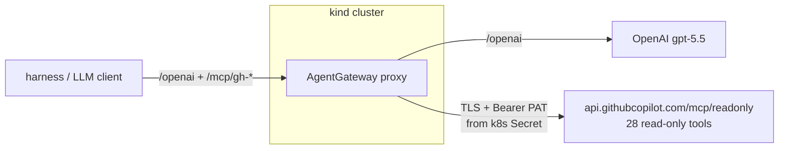
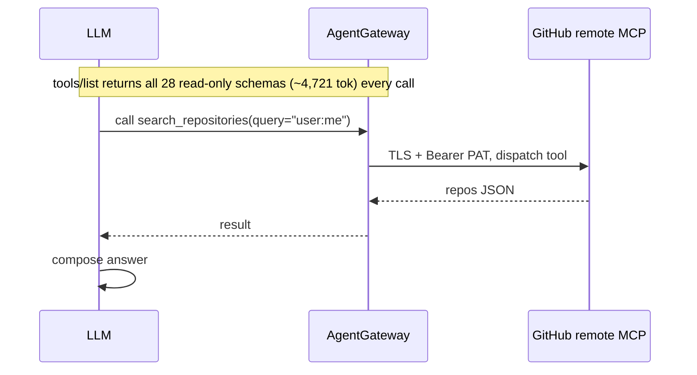
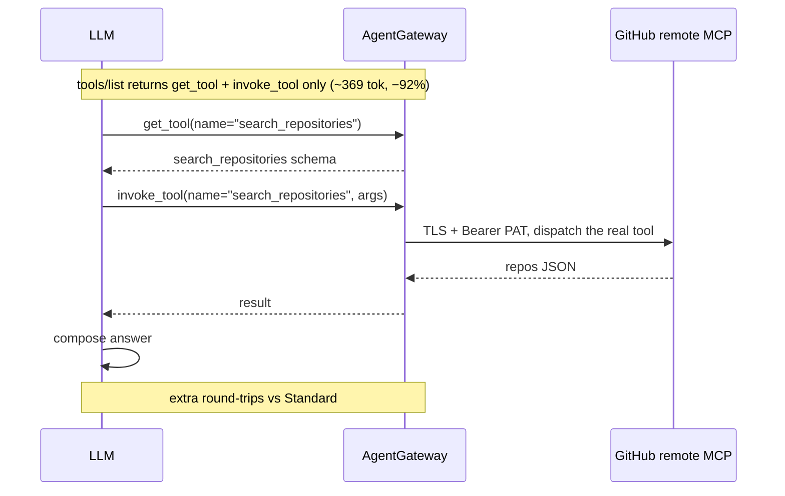
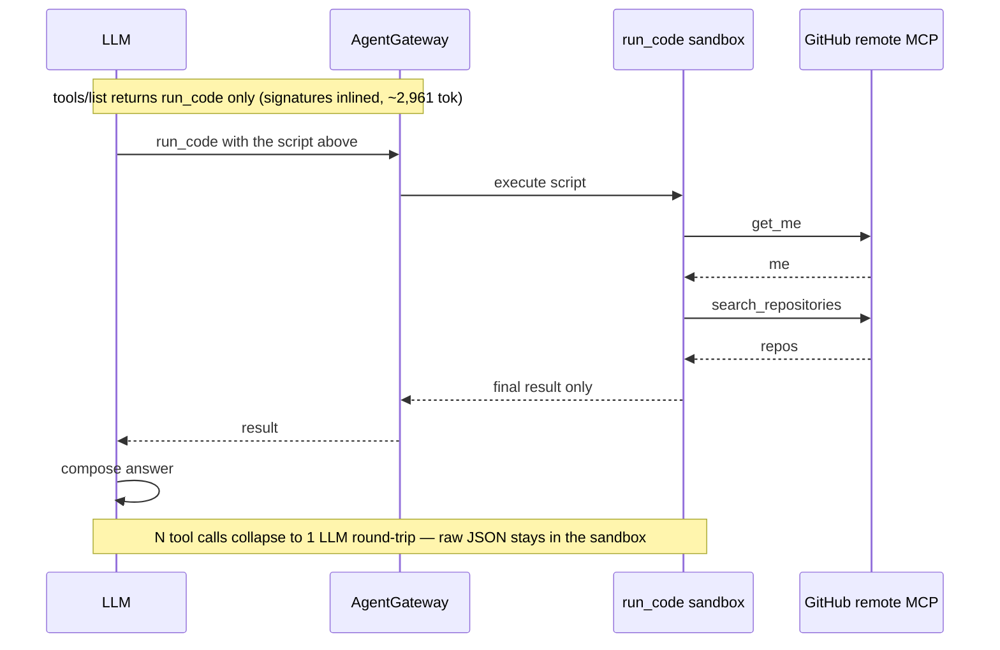
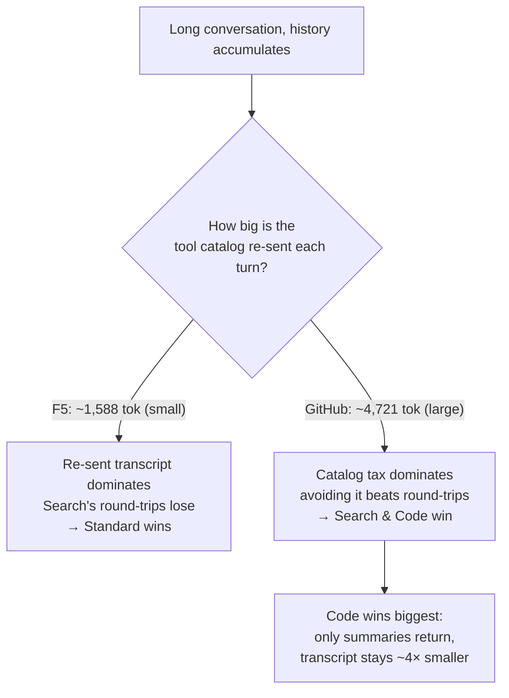
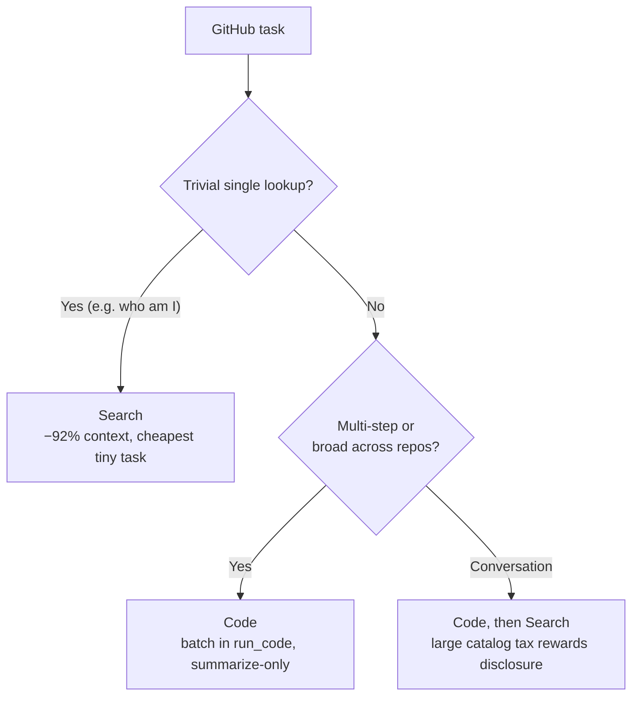

# 104 — GitHub (external MCP) Tool Modes: does progressive disclosure save money?

Front **GitHub's official remote MCP server** with AgentGateway and ask an LLM
developer questions about your GitHub — through each
[MCP tool mode](https://docs.solo.io/agentgateway/latest/mcp/tool-mode/). You watch
exactly which tools the model calls, how many round-trips it takes, and what each
costs in tokens.

This is the **external MCP** companion to demo 103 (which fronted a local F5 MCP).
The MCP server here is **not in your cluster** — it's GitHub's hosted
`api.githubcopilot.com/mcp`. AgentGateway targets it over TLS and injects your PAT
as a Bearer token, pinned to the **read-only** surface (28 tools, zero write tools).

> **The question:** does Search/Code mode save money — and is the answer the same as
> for F5? **No.** GitHub's tool catalog is ~3× larger and more verbose than F5's, and
> that one fact flips the verdict: here progressive disclosure wins in *both* single
> calls and long conversations, and **Code mode is the clear winner.**

---

## The three tool modes

All three front the **same external** GitHub MCP. Only `toolMode` differs.

| Mode | `toolMode` | Tools the model sees | First-call tool context | How it works |
|------|-----------|:--------------------:|:----------------------:|--------------|
| **Standard** | `Standard` | **28** (all read-only) | ~4,721 tok | Full GitHub catalog injected every call; model calls tools directly |
| **Search** | `Search` | **2** | **~369 tok (−92%)** | `get_tool` + `invoke_tool`; model discovers a tool, then invokes it |
| **Code** | `Code` | **1** | ~2,961 tok (−37%) | `run_code`; model writes JS that calls GitHub tools in a sandbox; only the final result returns |

> Unlike F5 (where Code's inlined signatures were *larger* than the catalog), GitHub's
> catalog is so verbose that **both** Search and Code shrink the per-call context.

---

## Architecture — the gateway fronts an external MCP and injects the credential



The PAT lives only in a gitignored `.env` → a Kubernetes `Secret`. The gateway reads
it and adds `Authorization: Bearer <PAT>` to every upstream MCP call. The client never
holds the credential.

---

## Flow 1 — Standard mode: all 28 tools, direct calls

The gateway injects the entire 28-tool catalog (~4,721 tokens) on every turn.



---

## Flow 2 — Search mode: 2 meta-tools, discover-then-invoke

The catalog collapses to **2 tools** (~369 tokens, −92%). The model discovers a tool,
then invokes it — each step an extra round-trip.



---

## Flow 3 — Code mode: 1 tool, batch the whole workflow in one script

The model writes JavaScript that calls several GitHub tools in one sandboxed
`run_code` execution. Many tool calls collapse into **one** LLM round-trip, and only
the final summarized result returns to the model — not every raw GitHub JSON blob.

The single `run_code` call the model emits looks like:

```js
const me = await get_me();
const repos = await search_repositories({ query: `user:${me.login} sort:updated` });
return summarize(me, repos);
```



---

## The money story (measured live on real GitHub data, gpt-5.5)

### Part A — single, short question (fresh session)

| Question | Standard | Search | Code |
|----------|---------:|-------:|-----:|
| me        | $0.0386 | **$0.0092** | $0.0248 |
| repos     | $0.0765 | $0.0497 | **$0.0311** |
| prs       | $0.5862 | $0.2698 ⚠️ | **$0.0646** |
| issues    | $0.0422 | $0.0327 | **$0.0227** |
| commits   | $0.0745 | $0.0843 | **$0.0371** |
| **average** | **$0.1636** | **$0.0891** | **$0.0361** |

First-call tool context: **Standard 4,721 · Search 369 (−92%) · Code 2,961 (−37%)**.

- **Code is cheapest on 4 of 5** and answered all 15 runs.
- The `prs` question is the showcase: across 196 repos, Standard looped 9 times over
  173K tokens ($0.586); Search hit the 10-call ceiling **without finishing** (⚠️); Code
  did it in one `run_code` ($0.065).
- Search wins only on the trivial `me` lookup.

### Part B — a 5-question conversation: the verdict vs F5 flips

| Mode | cum. total tokens | cum. cost | vs Standard |
|------|------------------:|----------:|------------:|
| **Standard** | 164,711 | **$0.503** | baseline |
| **Search** | 108,410 | **$0.389** | **−23%** |
| **Code** | 39,133 | **$0.139** | **−72%** |

In demo 103 (F5) Search cost ~4.8× *more* over a conversation. **Here Search is 23%
cheaper and Code is 72% cheaper.** Why the flip? ⤵

### Flow 4 — why GitHub flips the F5 verdict: catalog size



With a small catalog (F5) the accumulated transcript is the dominant cost, so re-sending
it on Search's extra round-trips loses. With a large catalog (GitHub) the per-turn
catalog tax dominates, so Search and Code — which avoid re-sending it — win. Code wins
biggest because only summaries return, keeping the transcript ~4× smaller (39K vs 165K).

### One caveat (see `COST-ANALYSIS.md`)

Code wins at **any** cache rate. Search-beats-Standard, however, depends on caching: at
the realistic ~50%-off rate Search is cheaper, but if cached tokens were nearly free,
Standard's huge-but-cached catalog wins. Code's advantage is structural; Search's is rate-dependent.

---

## Flow 5 — which mode should you pick?



| Workload | Winner | Why |
|----------|--------|-----|
| Trivial single lookup | **Search** | −92% tool context, cheapest on `me` |
| Broad / multi-step task | **Code** | one `run_code` vs Standard's thrash / Search's non-convergence |
| Long conversation | **Code**, then Search | huge catalog tax makes progressive disclosure pay off both ways |

**Compare with demo 103 (F5):** same three modes, *opposite* conversation verdict. The
demo lets you measure this for your own catalog and conversation depth.

---

## Prerequisites

`kind`, `kubectl`, `helm`, `python3` (≥ 3.10). No Docker build — the MCP server is
external. Env vars:

| Variable | Purpose |
|----------|---------|
| `AGENTGATEWAY_LICENSE_KEY` | Solo Enterprise license |
| `OPENAI_API_KEY` | LLM via the `/openai` gateway route |
| `GITHUB_PAT` | injected as a Bearer token to GitHub's remote MCP |

## Quick start

```bash
cp .env.example .env        # fill in the keys + GITHUB_PAT
set -a; . .env; set +a
./deploy.sh                 # kind + AGW + OpenAI backend + GitHub external MCP (std/search/code)
./test.sh                   # asks one question through all 3 modes, shows tokens
```

## Reproduce the full report

```bash
kubectl port-forward deployment/agentgateway-proxy -n agentgateway-system 8080:80 &
kubectl port-forward svc/prometheus-prometheus-pushgateway -n observability 9091:9091 &

# Part A — single-call, 5 questions × 3 modes
LLM_NO_TEMPERATURE=1 ./harness/.venv/bin/python harness/gh_questions.py

# Part B — one ongoing 5-question conversation × 3 modes
LLM_NO_TEMPERATURE=1 ./harness/.venv/bin/python harness/gh_conversation.py
```

### Ask your own questions (interactive)

```bash
cd harness
./.venv/bin/python gh_chat.py search      # then type questions; 'quit' to exit
./.venv/bin/python gh_chat.py code
./.venv/bin/python gh_chat.py standard    # for contrast
```

## Cleanup

```bash
./cleanup.sh                # deletes the kind cluster
```

## Security & safety notes

- **Read-only by construction.** The upstream path is `/mcp/readonly` — GitHub's
  read-only MCP surface (28 `get_`/`list_`/`search_` tools, zero write tools). Even
  though a PAT may carry write scopes, the model cannot mutate your repos.
  (Do **not** use `/mcp/all/readonly` — it is *not* read-only and exposes `create_`/
  `delete_` tools.)
- **The PAT never lands in git.** It lives in the gitignored `.env`, becomes a
  Kubernetes `Secret`, and the gateway injects it upstream. Manifests carry only
  `__GITHUB_PAT__` placeholders. Prefer a least-privilege, read-only PAT.
- Costs are gpt-5.5 list-price, cache-aware estimates — override `IN_PER_1K` /
  `CACHED_IN_PER_1K` / `OUT_PER_1K` with your contracted rates.
- Full breakdown in [`COST-ANALYSIS.md`](./COST-ANALYSIS.md); narrative test report in
  [`REPORT.md`](./REPORT.md); the small-catalog contrast in demo `103`.
