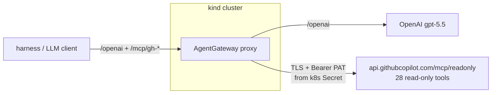
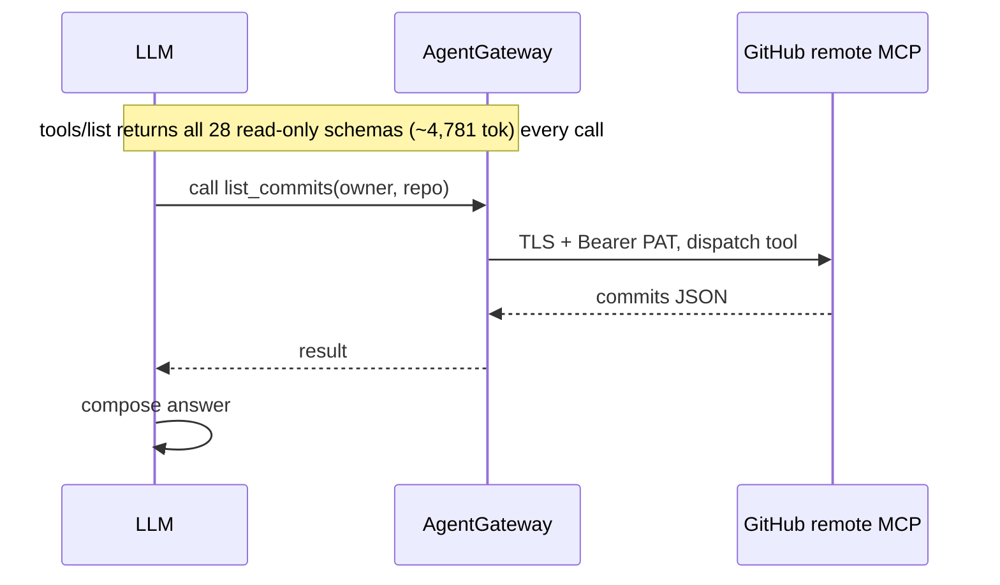
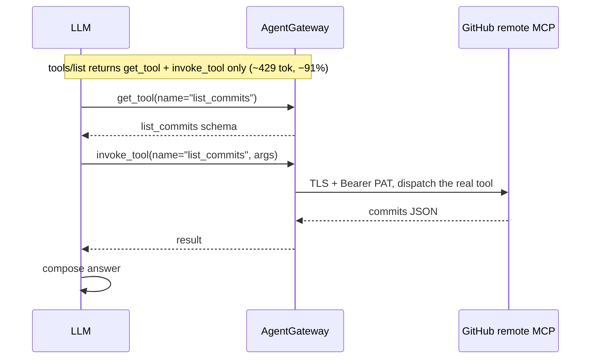
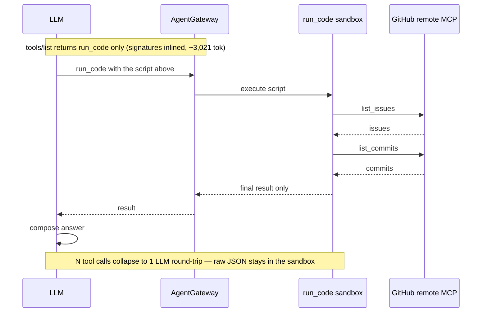
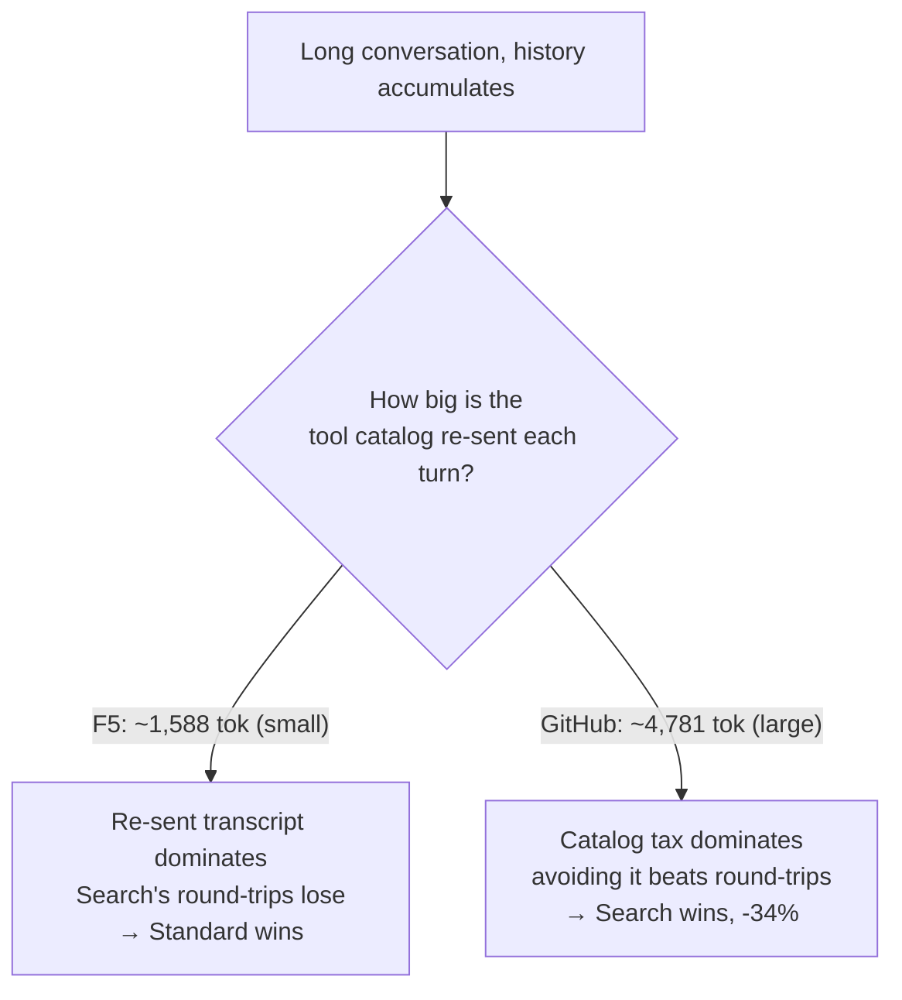
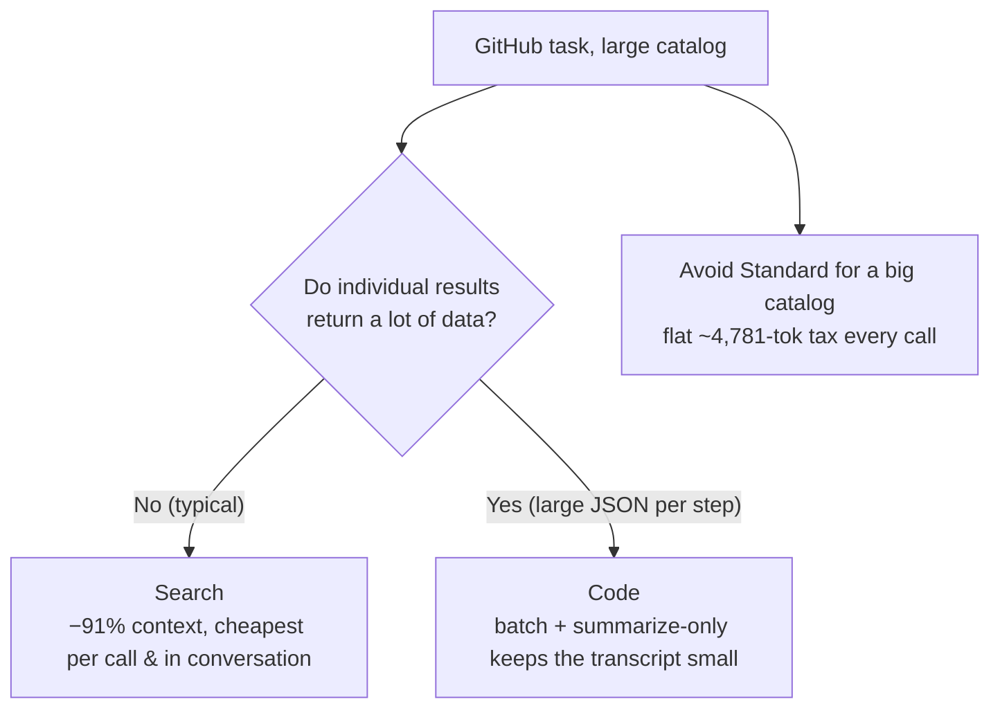

# 104 — GitHub (external MCP) Tool Modes: does progressive disclosure save money?

Front **GitHub's official remote MCP server** with AgentGateway and ask an LLM
questions about a GitHub repo — through each
[MCP tool mode](https://docs.solo.io/agentgateway/latest/mcp/tool-mode/). You watch
exactly which tools the model calls, how many round-trips it takes, and what each
costs in tokens.

This is the **external MCP** companion to demo 103 (which fronted a local F5 MCP).
The MCP server here is **not in your cluster** — it's GitHub's hosted
`api.githubcopilot.com/mcp`. AgentGateway targets it over TLS and injects a PAT as a
Bearer token, pinned to the **read-only** surface (28 tools, zero write tools).

> **Safety first.** Every question is pinned to **one dedicated sandbox repo** —
> [`sebbycorp/agw-tokenomics-sandbox`](https://github.com/sebbycorp/agw-tokenomics-sandbox) —
> via hard-coded `owner/repo` in each question *and* a read-only system instruction.
> For a hard guarantee, pair it with a **fine-grained, single-repo, read-only PAT**
> (steps below). The test then cannot read or write anything else.

> **The question:** does Search/Code mode save money — and is the answer the same as
> for F5? **No.** GitHub's tool catalog is ~3× larger and more verbose than F5's, and
> that one fact flips the verdict: here **Search is the clear money-saver**, both per
> call and across a conversation.

---

## The three tool modes

All three front the **same external** GitHub MCP. Only `toolMode` differs.

| Mode | `toolMode` | Tools the model sees | First-call tool context | How it works |
|------|-----------|:--------------------:|:----------------------:|--------------|
| **Standard** | `Standard` | **28** (all read-only) | ~4,781 tok | Full GitHub catalog injected every call; model calls tools directly |
| **Search** | `Search` | **2** | **~429 tok (−91%)** | `get_tool` + `invoke_tool`; model discovers a tool, then invokes it |
| **Code** | `Code` | **1** | ~3,021 tok (−37%) | `run_code`; model writes JS that calls GitHub tools in a sandbox; only the final result returns |

---

## Architecture — gateway fronts an external MCP, injects the credential, pins one repo



The PAT lives only in a gitignored `.env` → a Kubernetes `Secret`. The gateway adds
`Authorization: Bearer <PAT>` to every upstream MCP call. The client never holds the
credential, and the upstream path (`/mcp/readonly`) exposes no write tools.

---

## Flow 1 — Standard mode: all 28 tools, direct calls

The gateway injects the entire 28-tool catalog (~4,781 tokens) on every turn.



---

## Flow 2 — Search mode: 2 meta-tools, discover-then-invoke

The catalog collapses to **2 tools** (~429 tokens, −91%). The model discovers a tool,
then invokes it — each step an extra round-trip, but tiny per-call context.



---

## Flow 3 — Code mode: 1 tool, batch the whole workflow in one script

The model writes JavaScript that calls several GitHub tools in one sandboxed
`run_code` execution. Many calls collapse into **one** LLM round-trip, and only the
final summarized result returns — not every raw GitHub JSON blob.

The single `run_code` call the model emits looks like:

```js
const issues = await list_issues({ owner: "sebbycorp", repo: "agw-tokenomics-sandbox" });
const commits = await list_commits({ owner: "sebbycorp", repo: "agw-tokenomics-sandbox" });
return summarize(issues, commits);
```



---

## The money story (measured live on the sandbox repo, gpt-5.5)

### Part A — single, short question (fresh session)

| Question | Standard | Search | Code |
|----------|---------:|-------:|-----:|
| repo      | $0.0354 | **$0.0173** | $0.0220 |
| commits   | $0.0312 | **$0.0132** | $0.0201 |
| issues    | $0.0270 | **$0.0146** | $0.0201 |
| prs       | $0.0268 | **$0.0125** | $0.0187 |
| contents  | $0.0274 | **$0.0125** | $0.0193 |
| **average** | **$0.0295** | **$0.0140** | **$0.0200** |

First-call tool context: **Standard 4,781 · Search 429 (−91%) · Code 3,021 (−37%)**.

- **Search is cheapest on all 5** (~53% under Standard). Little result data means its
  extra round-trips are cheap, so the −91% context wins outright.
- **Code beats Standard but not Search.** Its batching pays off only when each task
  returns enough data — a small repo doesn't provide it.

### Part B — a 5-question conversation

| Mode | cum. total tokens | cum. cost | vs Standard |
|------|------------------:|----------:|------------:|
| **Standard** | 125,681 | $0.379 | baseline |
| **Search** | 49,223 | **$0.171** | **−55%** |
| Code | 72,157 | $0.238 | −37% |

In demo 103 (F5) Search cost ~4.8× *more* over a conversation. **Here Search is 55%
cheaper** — and robust across cache rates. (Absolute conversation dollars vary run-to-run;
the Search win does not — see [`REPORT.md`](./REPORT.md) §Reproducibility.) Why the flip? ⤵

### Flow 4 — why GitHub flips the F5 verdict: catalog size



With a small catalog (F5) the accumulated transcript is the dominant cost, so re-sending
it on Search's extra round-trips loses. With a large catalog (GitHub) the per-turn
catalog tax dominates, so Search — which avoids re-sending it — wins.

### When does Code overtake Search?

Code wins only when each task returns **large** results: it returns just a summary, so
the transcript stays small. On this sandbox repo results are tiny, so Code beats Standard
but stays above Search. Reach for Code when a single step pulls a lot of GitHub JSON.

---

## Flow 5 — which mode should you pick?



| Workload | Winner | Why |
|----------|--------|-----|
| Single call / conversation, modest results | **Search** | −91% context; cheapest per call and −34% in conversation |
| Step that returns large results | **Code** | summarize-only keeps the transcript small |
| Large catalog, any case | **not Standard** | flat ~4,781-token catalog tax every call |

**Compare with demo 103 (F5):** same three modes, *opposite* conversation verdict —
because F5's catalog is small. Measure for your own catalog and result sizes.

---

## Scope & safety (how this test is locked to one repo)

1. **Read-only by construction.** The upstream path is `/mcp/readonly` — GitHub's
   read-only MCP surface (28 `get_`/`list_`/`search_` tools, zero write tools). Even a
   write-scoped PAT cannot mutate anything. (Do **not** use `/mcp/all/readonly` — it is
   *not* read-only and exposes `create_`/`delete_` tools.)
2. **Pinned to one repo.** Every harness question hard-codes
   `sebbycorp/agw-tokenomics-sandbox`, and a system instruction tells the model to
   access only that repo. Override with `GH_REPO=owner/name`.
3. **Hard guarantee — use a fine-grained, single-repo PAT.** This makes touching any
   other repo *impossible* at the token level:
   - GitHub → **Settings → Developer settings → Personal access tokens → Fine-grained tokens → Generate new token**
   - **Resource owner:** `sebbycorp` · **Repository access:** *Only select repositories* → `agw-tokenomics-sandbox`
   - **Permissions (read-only):** Repository → Contents: *Read*, Issues: *Read*, Pull requests: *Read*, Metadata: *Read* (auto)
   - Put it in `.env` as `GITHUB_PAT=` and redeploy. The gateway now physically cannot reach any other repo.
4. **The PAT never lands in git.** It lives in the gitignored `.env`, becomes a
   Kubernetes `Secret`, and the gateway injects it upstream. Manifests carry only a
   `__GITHUB_PAT__` placeholder.

---

## Prerequisites

`kind`, `kubectl`, `helm`, `python3` (≥ 3.10). No Docker build — the MCP server is
external. Env vars:

| Variable | Purpose |
|----------|---------|
| `AGENTGATEWAY_LICENSE_KEY` | Solo Enterprise license |
| `OPENAI_API_KEY` | LLM via the `/openai` gateway route |
| `GITHUB_PAT` | fine-grained, read-only, single-repo PAT (see Scope & safety) |

## Quick start

```bash
cp .env.example .env        # fill in the keys + the single-repo read-only GITHUB_PAT
set -a; . .env; set +a
./deploy.sh                 # kind + AGW + OpenAI backend + GitHub external MCP (std/search/code)
./test.sh                   # asks one question through all 3 modes, shows tokens
```

## Reproduce the full report

```bash
kubectl port-forward deployment/agentgateway-proxy -n agentgateway-system 8080:80 &
kubectl port-forward svc/prometheus-prometheus-pushgateway -n observability 9091:9091 &
LLM_NO_TEMPERATURE=1 ./harness/.venv/bin/python harness/gh_questions.py     # single-call, 5 Qs × 3 modes
LLM_NO_TEMPERATURE=1 ./harness/.venv/bin/python harness/gh_conversation.py  # 5-turn conversation × 3 modes
```

### Ask your own questions (interactive, still repo-scoped)

```bash
cd harness
./.venv/bin/python gh_chat.py search "list the open issues"
./.venv/bin/python gh_chat.py code "summarize recent activity"
./.venv/bin/python gh_chat.py standard "list the open pull requests"
```

## Cleanup

```bash
./cleanup.sh                # deletes the kind cluster
# the sandbox repo is yours to keep or delete:
#   gh repo delete sebbycorp/agw-tokenomics-sandbox --yes
```

## Notes

- Costs are gpt-5.5 list-price, cache-aware estimates — override `IN_PER_1K` /
  `CACHED_IN_PER_1K` / `OUT_PER_1K` with your contracted rates.
- Full breakdown in [`COST-ANALYSIS.md`](./COST-ANALYSIS.md); narrative test report in
  [`REPORT.md`](./REPORT.md); the small-catalog contrast in demo `103`.
