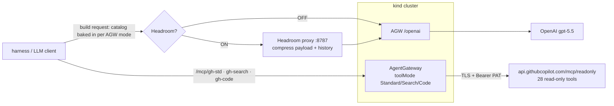

# 105 — AgentGateway tool modes **+ Headroom**: do the savings *stack*?

Demo 104 showed AgentGateway's MCP **tool modes** (Standard / Search / Code) cut token
cost by shrinking the **tool-catalog tax** — the 28 GitHub tool schemas re-injected every
turn, plus orchestration round-trips.

[**Headroom**](https://github.com/headroomlabs-ai/headroom) claims 60–95% token savings on
the *same kind of workload* ("GitHub issue triage 73%"). But Headroom attacks a **different
layer**: it's a compression proxy that shrinks the **content payload** — the verbose GitHub
JSON results, files, and conversation history — before they reach the LLM.

> **They are not substitutes.** AGW shrinks the *schemas + round-trips*; Headroom shrinks the
> *result data + history*. This demo runs the **identical 104 GitHub workload** with both
> knobs and asks: **do the two savings stack — and where?** It is *not* a "which one wins"
> bake-off; the point is whether stacking compounds.

| | Reduces | Mechanism |
|---|---|---|
| **AGW tool modes** | tool-catalog tax + round-trips | Search: 28 tools → 2 meta-tools (−91% catalog). Code: N calls → 1 round-trip, summary-only |
| **Headroom** | content/result payload + history | ML/AST/JSON compressors (SmartCrusher, CodeCompressor, Kompress model), reversible |

> **⚠️ Results status:** the harness, matrix driver, and quality judge are built and
> run-ready, but **the numbers in [`REPORT.md`](./REPORT.md) and [`COST-ANALYSIS.md`](./COST-ANALYSIS.md)
> are PENDING a live run** — they require your license + OpenAI spend on a live cluster.
> Run `./run_matrix.sh` (below) to fill them in. Nothing in this repo fabricates measured costs.

---

## Architecture — two independent knobs in one cluster



- **Knob 1 — AGW `toolMode`:** three backends `gh-std` / `gh-search` / `gh-code` (acts on
  the MCP catalog, exactly as 104).
- **Knob 2 — Headroom:** OFF = harness → AGW `/openai`; ON = harness → Headroom proxy → AGW
  `/openai`. Flipped per-run with `HEADROOM=on` + `LLM_URL`.
- They touch **different arrows** — that's *why* stacking is possible.

The catalog effect is independent of which LLM URL is used: the harness bakes the tool
catalog into the request body from the MCP `tools/list` response, so the two knobs stay
orthogonal.

> **Headroom integration (verified from the source):** the proxy forwards verbatim to a
> required `--upstream` / `HEADROOM_PROXY_UPSTREAM`, so we point it at AGW `/openai`
> (outcome A — AGW tracing still sees every call). **Compression is OFF by default**
> (`--compression` / `HEADROOM_PROXY_COMPRESSION`, `--compression-mode` default `off`) — so
> `run_matrix.sh` and `test.sh` launch it with compression **explicitly enabled**. Without
> that, the ON column would equal OFF and the comparison would be meaningless. If your
> installed build's flags differ, confirm with `harness/.venv/bin/headroom proxy --help` and
> override `HEADROOM_PROXY_*` in `.env`.

---

## The experiment — 12 cells

**3 AGW modes × 2 Headroom states × 2 repos.** Each cell records input/cached/output tokens,
USD cost, round-trips, and an **LLM-judge quality score** (vs the Standard/OFF baseline answer).

| AGW mode \ Headroom | OFF | ON |
|---|---|---|
| **Standard** | baseline (= 104) | catalog tax present + payload compressed |
| **Search** | AGW best (= 104) | both stacked — expected biggest win on the large repo |
| **Code** | summarize-only | does compression still help when results are pre-summarized? |

Run on **two repos**:
- **small** — the 104 sandbox `sebbycorp/agw-tokenomics-sandbox` (apples-to-apples vs 104).
- **large** — a read-only repo with heavy JSON payloads (set `REPO_LARGE`), giving Headroom
  something real to compress.

### Why a quality judge

Headroom changes what the model sees, so a cheaper cell is only a win if the answer is still
right. `judge.py` scores every cell's answer 0–5 against the Standard/OFF reference, so we
never celebrate cheaper-but-wrong. The judge call always runs OFF-path (uncompressed).

---

## Prerequisites

`kind`, `kubectl`, `helm`, `python3` (≥ 3.10). Env vars:

| Variable | Purpose |
|----------|---------|
| `AGENTGATEWAY_LICENSE_KEY` | Solo Enterprise license |
| `OPENAI_API_KEY` | LLM via the `/openai` gateway route |
| `GITHUB_PAT` | read-only PAT that can read **both** `REPO_SMALL` and `REPO_LARGE` |
| `REPO_LARGE` | large read-only repo for the heavy-payload half (required by `run_matrix.sh`) |

## Quick start

```bash
cp .env.example .env        # fill in keys + REPO_LARGE
set -a; . .env; set +a
./deploy.sh                 # kind + AGW + OpenAI + GitHub MCP (std/search/code) + installs Headroom
./test.sh                   # one question, Headroom OFF vs ON — sanity-check the wiring
```

## Run the full matrix + quality judge

```bash
kubectl port-forward svc/prometheus-prometheus-pushgateway -n observability 9091:9091 &   # optional, for Grafana
REPO_LARGE=owner/big-readonly-repo ./run_matrix.sh
# → writes harness/results.jsonl (every cell + answer), prints a cost table and a
#   per-cell mean quality score. Transcribe the numbers into COST-ANALYSIS.md / REPORT.md.
```

### Multi-turn (conversation) variant

```bash
# OFF:
GH_REPO=owner/repo HEADROOM=off ./harness/.venv/bin/python harness/gh_conversation.py
# ON (proxy must be running — run_matrix/test.sh launch it; or launch it yourself):
GH_REPO=owner/repo HEADROOM=on LLM_URL=http://localhost:8787/openai \
  ./harness/.venv/bin/python harness/gh_conversation.py
```

---

## Scope & safety (identical to 104)

1. **Read-only by construction** — upstream is `/mcp/readonly` (28 `get_`/`list_`/`search_`
   tools, zero write tools). Never `/mcp/all/readonly`.
2. **Pinned repos** — every question hard-codes the target repo (`GH_REPO`), and a system
   instruction restricts the model to it. **Both** repos must be read-only-pinned.
3. **Hard guarantee** — use a fine-grained PAT scoped to only `REPO_SMALL` + `REPO_LARGE`,
   read-only (Contents/Issues/Pull requests/Metadata: Read).
4. **Secrets never in git** — `.env` is gitignored → Kubernetes `Secret`; manifests carry a
   `__GITHUB_PAT__` placeholder. Headroom runs locally; payload data stays on-device.

## Cleanup

```bash
./cleanup.sh                # stops the Headroom proxy + deletes the kind cluster
```

## Notes

- Costs are gpt-5.5 list-price, cache-aware estimates — override `IN_PER_1K` /
  `CACHED_IN_PER_1K` / `OUT_PER_1K` with your contracted rates.
- Compare with demo **104** (AGW tool modes, no compression) and **103** (small F5 catalog).
