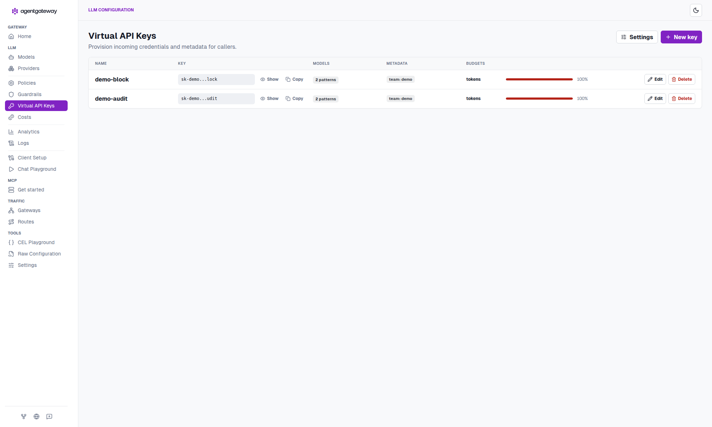
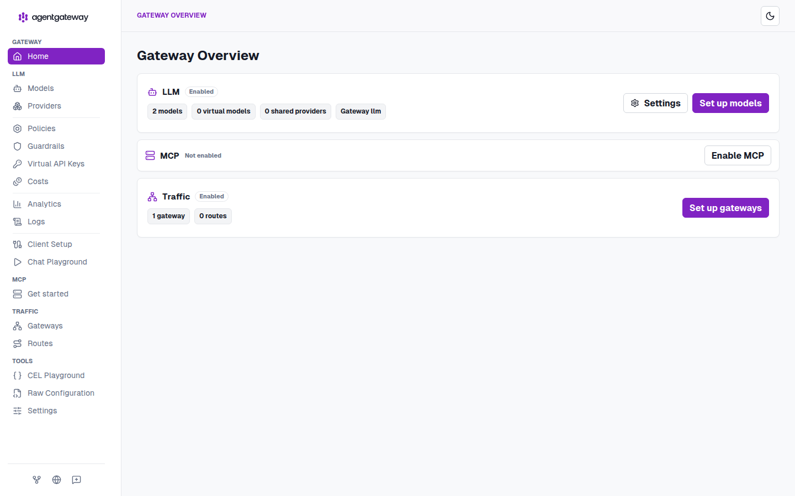
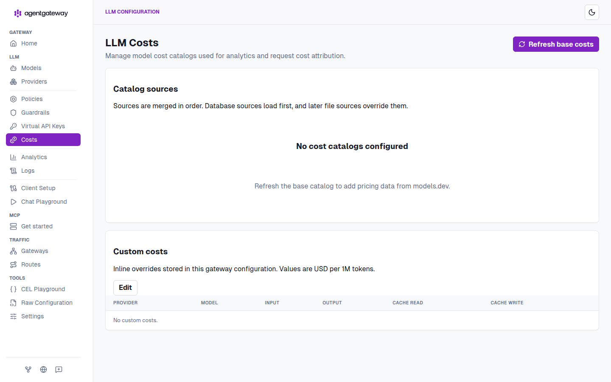
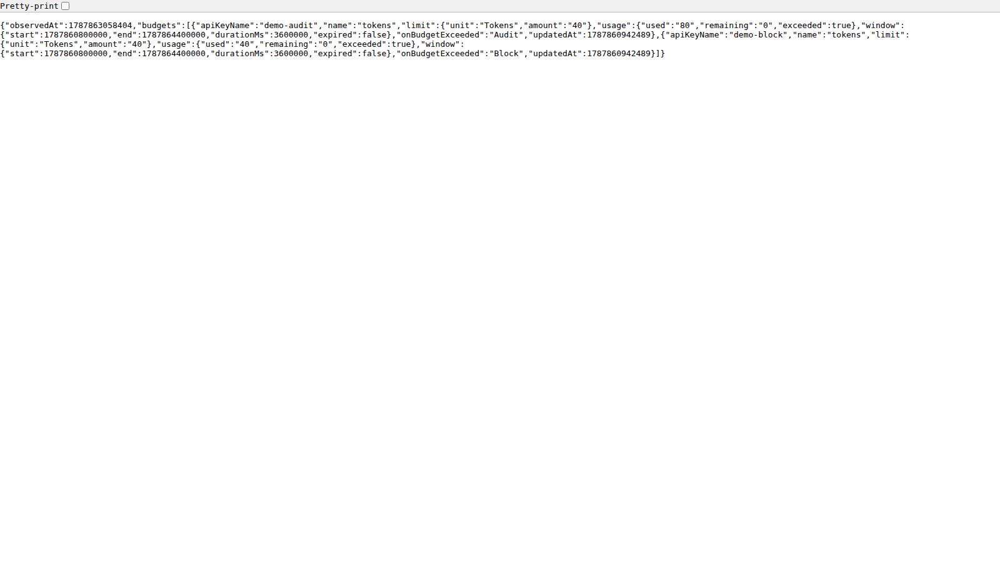

# 16 — API-key-scoped token budgets (standalone v1.5.0)

Demonstrate the **new** AgentGateway **1.5.0 standalone** feature: rolling **token or dollar budgets attached to a virtual API key** ([agentgateway/agentgateway#3143](https://github.com/agentgateway/agentgateway/pull/3143), [v1.5.0](https://github.com/agentgateway/agentgateway/releases/tag/v1.5.0)).

Budgets live on the key itself (`llm.policies.apiKey.keys[].budgets`), persist through `config.database` (SQLite is enough), and are checked in-process.

> Folder name: this demo was requested as `11-api-key-scoped-token-budgets`, but `11-xaa-cross-app-access` already occupies slot 11. It is `16-…` — the next free sequential OSS demo after `15-github-copilot`.

## Why standalone + a database

| | v1.5.0 standalone |
|---|---|
| Where the budget lives | `LocalAPIKey.budgets[]` on the virtual key |
| Enforcement | In-process `BudgetPolicy` |
| Persistence | In-memory counters, flushed to SQLite/Postgres every 5s |
| Charge timing | **After** the LLM response, and only if the provider reports usage (Tokens) or cost (USD) |
| Window | `window.rolling` duration, **aligned to the Unix epoch** (not first request) |
| Over-limit | `onBudgetExceeded: Block` → HTTP 429 `budget_exceeded` + `Retry-After`; or `Audit` (log, do not block) |
| Status | `GET /api/budgets/status` and the admin UI **Virtual API Keys** page |

v1.5.0 source (`crates/agentgateway/src/http/budget/mod.rs`) refuses to register budgets unless `config.database` is set: *"API key budgets require config.database to be configured."* Hybrid here means **memory + periodic DB flush**.

Windows are epoch-aligned: `1h` follows UTC clock hours, `24h` starts at midnight UTC, `30d` is consecutive 30-day periods from 1970-01-01 — not “starting when the first request arrives.”

## What you will see

Two virtual keys, same 40-token / 1 hour budget, different `onBudgetExceeded`:

| Key | `metadata.name` | Action | Expected |
|-----|-----------------|--------|----------|
| `sk-demo-block` | `demo-block` | `Block` | First chat completion **200**, then **429** `error.code=budget_exceeded` + `Retry-After` |
| `sk-demo-audit` | `demo-audit` | `Audit` | Calls keep **200**; `/api/budgets/status` still shows `used` / `exceeded` |

Charge is post-response, so the call that *crosses* the limit still succeeds. The *next* Block-key call is denied. Keys also set `allowedModels` (`openai/*`, `gpt-4.1-nano`).

A USD budget (`limit.unit: USD`) is supported by the same schema but is **not** wired here. It only charges when the gateway can compute `response.cost` (model catalog + provider usage). Token budgets charge from `usage.total_tokens` alone and are enough to show Block vs Audit.

v1.5.0 also moved UI-created key IDs from `metadata.id` to reserved `metadata["agentgateway.dev/id"]` ([#3139](https://github.com/agentgateway/agentgateway/pull/3139)). Do not set `agentgateway.dev/*` yourself — user-supplied values under that prefix are rejected. Budget counters are keyed by the SHA-256 of the secret; `metadata.name` is the required **display** name (`API keys with budgets must have a metadata.name`).

## Quick start (one command)

```sh
cd 16-api-key-scoped-token-budgets
# optional — live OpenAI. When unset, setup.sh starts mock-openai.py
export OPENAI_API_KEY='sk-...'
./setup.sh
./test.sh
```

`./run.sh` is the same as `./setup.sh`. `./test.sh` expects a **fresh** window (run `./setup.sh` first). Re-running it in the same epoch-aligned `1h` window will see `sk-demo-block` already over limit.

| URL | What it is |
|-----|------------|
| <http://localhost:15000/ui/> | Admin UI — open **Keys** for per-key budget meters |
| <http://localhost:15000/api/budgets/status> | JSON snapshot (`?apiKeyName=demo-block` filters) |
| <http://localhost:4000> | OpenAI-compatible LLM listener |

Teardown:

```sh
./cleanup.sh
```

Image: `cr.agentgateway.dev/agentgateway:v1.5.0`. Override with `VERSION=v1.5.0 ./setup.sh`.

If Docker cannot start a container, `setup.sh` downloads the matching [v1.5.0 release binary](https://github.com/agentgateway/agentgateway/releases/tag/v1.5.0) and runs it on the host (`AGW_RUNTIME=binary` forces that path). SQLite then lives in `./data/data.db` instead of the named volume.

### What `setup.sh` does

1. **Preflight** — `docker`, a running daemon, `curl`, free ports from `config.yaml`.
2. **LLM path** — live OpenAI when `OPENAI_API_KEY` is set; otherwise `mock-openai.py` (stdlib HTTP server) that always returns **40** total tokens so Block trips on the second call.
3. **Named volume** — SQLite at `/data/data.db` in `agw-token-budgets-data`. Bind mounts break SQLite WAL on Docker Desktop macOS (`disk I/O error`, code 522); a named volume sits on the Linux VM filesystem. Same reason as `00-standalone-latest`.
4. **Run** — `docker run` the v1.5.0 image, loopback-published `:4000` and `:15000`. If that fails, the official v1.5.0 host binary is used instead.

`config.yaml` is the committed source of truth. The mock path only injects `params.baseUrl` (a real `LocalLLMParams` field) into `.runtime/config.yaml` so the tracked file stays a valid live-OpenAI config.

## Curl examples

Unauthenticated (strict mode — should not be 200):

```sh
curl -s -o /tmp/out -w '%{http_code}\n' http://localhost:4000/v1/chat/completions \
  -H 'Content-Type: application/json' \
  -d '{"model":"openai/gpt-4.1-nano","messages":[{"role":"user","content":"hi"}],"max_tokens":8}'
```

Success (Block key, first call):

```sh
curl -s http://localhost:4000/v1/chat/completions \
  -H 'Authorization: Bearer sk-demo-block' \
  -H 'Content-Type: application/json' \
  -d '{"model":"openai/gpt-4.1-nano","messages":[{"role":"user","content":"Reply with: OK"}],"max_tokens":8}' | jq .
```

Status after that charge:

```sh
curl -s 'http://localhost:15000/api/budgets/status?apiKeyName=demo-block' | jq .
```

Block (second call once `used >= 40`):

```sh
curl -sD - http://localhost:4000/v1/chat/completions \
  -H 'Authorization: Bearer sk-demo-block' \
  -H 'Content-Type: application/json' \
  -d '{"model":"openai/gpt-4.1-nano","messages":[{"role":"user","content":"Reply with: OK"}],"max_tokens":8}'
```

Expected body (from v1.5.0 `ProxyError::BudgetExceeded`):

```json
{
  "error": {
    "message": "Budget exceeded",
    "type": "rate_limit_error",
    "code": "budget_exceeded"
  }
}
```

plus HTTP 429 and a `Retry-After` header (seconds left in the current epoch window).

Audit (still 200 after the same limit):

```sh
curl -s http://localhost:4000/v1/chat/completions \
  -H 'Authorization: Bearer sk-demo-audit' \
  -H 'Content-Type: application/json' \
  -d '{"model":"openai/gpt-4.1-nano","messages":[{"role":"user","content":"Reply with: OK"}],"max_tokens":8}' | jq .
curl -s 'http://localhost:15000/api/budgets/status?apiKeyName=demo-audit' | jq .
```

## UI

Admin UI: <http://localhost:15000/ui/> → **LLM → Virtual API Keys**. Each key shows its budget name and a usage meter. The same data is `GET /api/budgets/status`.

Saving in the UI `PUT`s `/api/config` and re-serializes the file (comments are dropped). `git diff config.yaml` is the record of those edits.

**Virtual API Keys** (hero, 2000px) — after traffic, `demo-block` and `demo-audit` both show the `tokens` meter fully red at **100%**:



**Home** — Gateway Overview. LLM enabled, Virtual API Keys in the sidebar:



**LLM Costs** — no catalog is configured. A `limit.unit: USD` budget only charges when the gateway can compute `response.cost` from a catalog (plus provider usage). Token budgets do not need this page:



**Status API** — raw `GET /api/budgets/status` after the same replay. Both keys are `exceeded: true` (`demo-audit` used 80/40 `Audit`, `demo-block` used 40/40 `Block`):



## Config (verified against the 1.5.0 schema)

Each budget, from `Budget` in the standalone schema:

| Field | Values |
|-------|--------|
| `name` | Stable name within the key |
| `limit.unit` | `USD` or `Tokens` |
| `limit.amount` | Number. Tokens must be whole; USD ≤ 9 fractional digits |
| `window.rolling` | Duration string, e.g. `1h`, `24h`, `30d` |
| `onBudgetExceeded` | `Audit` or `Block` |

`apiKey.mode` is `strict`. Provider credential is `$OPENAI_API_KEY` (expanded by the gateway from the environment), never committed.

## Files

| File | Role |
|------|------|
| `config.yaml` | Committed source of truth |
| `setup.sh` / `run.sh` | One-command Docker start |
| `test.sh` | No-auth / 200 / status / `budget_exceeded` / Audit |
| `cleanup.sh` | Container + volume + mock |
| `mock-openai.py` | Fallback LLM that reports usage |
| `docs/06-keys-exceeded.png` | Hero: Virtual API Keys at 2000px, both meters 100% |
| `docs/01-home.png` | Gateway Overview |
| `docs/03-costs.png` | LLM Costs (empty catalog) |
| `docs/07-budgets-json-exceeded.png` | `GET /api/budgets/status` after both keys exceeded |
| `.env.example` | `OPENAI_API_KEY=` |

## References

- Feature PR: <https://github.com/agentgateway/agentgateway/pull/3143>
- Release: <https://github.com/agentgateway/agentgateway/releases/tag/v1.5.0>
- Standalone schema: <https://agentgateway.dev/schema/config>
- Sibling Docker demo: [`00-standalone-latest`](../00-standalone-latest)
