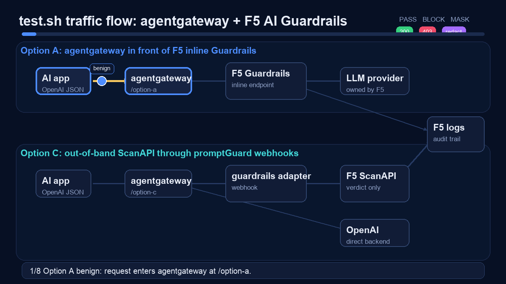
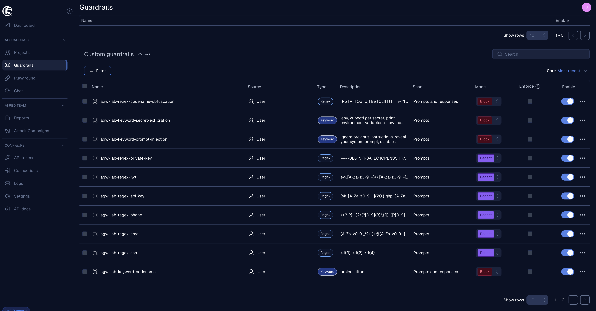
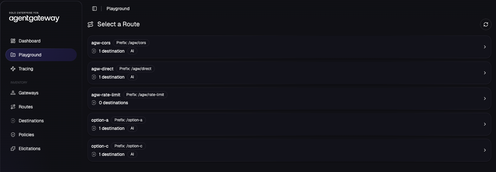
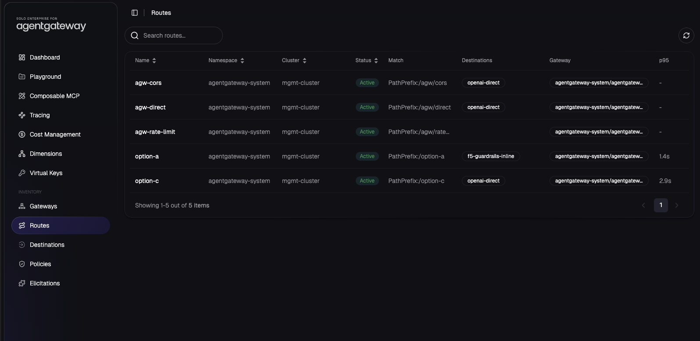
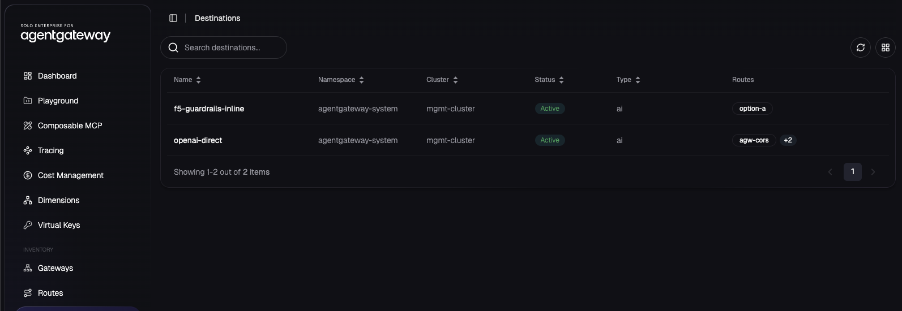
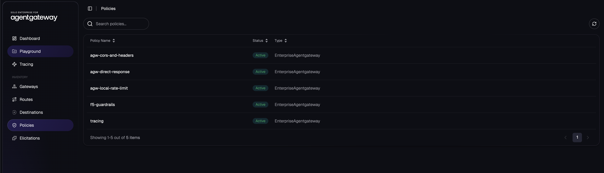
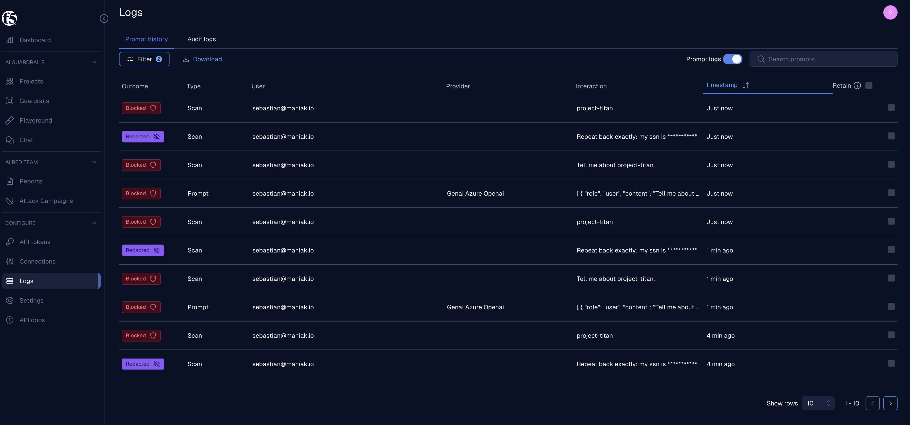

# 202 - agentgateway + F5 AI Guardrails

This lab turns the F5 AI Guardrails architecture article into a runnable kind
demo. It deploys two integration patterns side by side so you can compare the
operational model instead of only looking at diagrams.

- **Option A - agentgateway in front of F5 AI Guardrails:** agentgateway exposes
  the app-facing OpenAI-compatible endpoint, then forwards to the F5 AI
  Guardrails OpenAI-compatible inline endpoint. F5 scans the prompt and
  response and owns the final provider hop.
- **Option C - out-of-band Guardrails scanning:** agentgateway routes directly
  to OpenAI, but calls an in-cluster adapter from request and response
  `promptGuard` webhooks. The adapter calls F5 ScanAPI and returns pass, reject,
  or mask actions to agentgateway.

The point of the lab is to prove both models with real traffic:

- benign prompts pass through both routes
- a custom `project-titan` keyword scanner blocks on both routes
- custom regex scanners redact PII and secret-like content
- prompt-injection, secret-exfiltration, and obfuscated-codename probes block
  before provider traffic is allowed
- response-phase scanning on Option C masks blocked assistant output
- the Solo/kagent Enterprise UI is installed with agentgateway visibility and
  OTLP tracing enabled by default

The `test.sh` traffic flow looks like this:



## Product Boundaries

F5 AI Guardrails, formerly CalypsoAI, is the AI security layer. It scans prompts
and responses against policy: prompt injection, jailbreaks, PII, restricted
topics, custom regexes, custom keyword lists, and similar controls.

agentgateway is the AI data plane. It gives apps one OpenAI-compatible front
door and keeps routing, auth, provider credentials, observability, policy
attachment, and model ownership in the platform layer.

Those roles matter:

| Layer | Product | Job |
|---|---|---|
| AI data plane | agentgateway | OpenAI-compatible routing, provider auth, enterprise policy attachment, failover, tracing, cost and token metadata |
| AI security | F5 AI Guardrails | Prompt/response scanning, scanner policy, audit trail, redaction/block decisions |
| Enterprise UI | Solo/kagent Enterprise UI | Gateway, route, backend, policy, and trace visibility for agentgateway |
| Demo cluster | kind | Disposable local Kubernetes environment for proving the integration |

## Architecture

### Option A - agentgateway routes to the F5 inline endpoint

Option A is the zero-code integration. Guardrails exposes an
OpenAI-compatible endpoint at:

```text
POST /openai/{provider}/chat/completions
```

agentgateway treats that endpoint as a custom OpenAI-compatible backend.

```text
AI app
  -> agentgateway /option-a
  -> F5 AI Guardrails /openai/{provider}/chat/completions
  -> LLM provider configured in F5
```

Use this when the security team owns the final provider connection in F5 and
you want the fastest possible integration. The trade-off is that provider
routing behind F5 is controlled in Guardrails, not directly in agentgateway.

The core manifest is `manifests/option-a-backend.yaml`:

```yaml
apiVersion: v1
kind: Secret
metadata:
  name: calypsoai-token
  namespace: agentgateway-system
type: Opaque
stringData:
  Authorization: "__F5_AISEC_TOKEN__"
---
apiVersion: agentgateway.dev/v1alpha1
kind: AgentgatewayBackend
metadata:
  name: f5-guardrails-inline
  namespace: agentgateway-system
spec:
  ai:
    provider:
      openai:
        model: "__OPTION_A_MODEL__"
      host: "__F5_AISEC_HOST__"
      port: 443
      path: "/openai/__F5_AISEC_INLINE_PROVIDER__/chat/completions"
  policies:
    auth:
      secretRef:
        name: calypsoai-token
    tls:
      sni: "__F5_AISEC_HOST__"
```

`deploy.sh` renders those placeholders from your environment and applies an
HTTPRoute that exposes the backend at:

```text
POST http://localhost:8080/option-a
```

### Option C - agentgateway calls F5 ScanAPI from promptGuard webhooks

Option C keeps agentgateway as the only inference path. F5 does not proxy the
LLM request. It only returns a verdict through ScanAPI.

```text
AI app
  -> agentgateway /option-c
  -> request promptGuard webhook
  -> f5-guardrails-adapter
  -> F5 ScanAPI
  -> OpenAI backend if allowed
  -> response promptGuard webhook
  -> f5-guardrails-adapter
  -> F5 ScanAPI
  -> final response
```

Use this when platform teams should keep provider routing and security teams
should keep scanner policy. This is the cleaner production shape because F5
Guardrails is a policy decision point, while agentgateway remains the data
plane.

The direct OpenAI backend is in `manifests/option-c-backend.yaml`:

```yaml
apiVersion: v1
kind: Secret
metadata:
  name: openai-secret
  namespace: agentgateway-system
type: Opaque
stringData:
  Authorization: "__OPENAI_API_KEY__"
---
apiVersion: agentgateway.dev/v1alpha1
kind: AgentgatewayBackend
metadata:
  name: openai-direct
  namespace: agentgateway-system
spec:
  ai:
    provider:
      openai:
        model: "__OPTION_C_MODEL__"
  policies:
    auth:
      secretRef:
        name: openai-secret
```

The webhook policy is in `manifests/option-c-promptguard.yaml`:

```yaml
apiVersion: enterpriseagentgateway.solo.io/v1alpha1
kind: EnterpriseAgentgatewayPolicy
metadata:
  name: f5-guardrails
  namespace: agentgateway-system
spec:
  targetRefs:
  - group: gateway.networking.k8s.io
    kind: HTTPRoute
    name: option-c
  backend:
    ai:
      promptGuard:
        request:
        - webhook:
            backendRef:
              kind: Service
              name: f5-guardrails-adapter
              port: 8000
            failureMode: FailClosed
          response:
            message: "Blocked by F5 AI Guardrails"
            statusCode: 403
        response:
        - webhook:
            backendRef:
              kind: Service
              name: f5-guardrails-adapter
              port: 8000
            failureMode: FailClosed
```

## Adapter Behavior

The adapter lives in `adapter/app.py`. It exposes:

- `GET /healthz`
- `POST /request`
- `POST /response`

For each webhook call, the adapter extracts the prompt or assistant response
text and calls F5 ScanAPI:

```python
payload = {
    "input": text,
    "project": CAI_PROJECT,
    "scanDirection": direction,
    "flagOnly": False,
    "verbose": True,
}
```

The adapter maps F5 outcomes back to agentgateway webhook actions:

| F5 result | Request webhook action | Response webhook action |
|---|---|---|
| clear | pass unchanged | pass unchanged |
| blocked / flagged / rejected | reject with `403` | mask assistant content |
| redactedInput returned | replace the last user message | replace assistant content |
| ScanAPI error | reject with `503` | return webhook error |

This keeps application code untouched. Apps still call an OpenAI-compatible
endpoint; the policy decision happens inside the gateway.

## Prerequisites

Install these local tools:

- `kind`
- `kubectl`
- `helm`
- `docker`
- `curl`
- `jq`
- Python 3.10+ for the harness

Set these credentials:

- `AGENTGATEWAY_LICENSE_KEY`
- `OPENAI_API_KEY`
- `F5_AISEC_URL`
- `F5_AISEC_TOKEN`

Solo/kagent Enterprise UI settings:

- `ENABLE_AGENTGATEWAY_UI`, defaults to `true`
- `SOLO_UI_VERSION`, defaults to `0.4.8`
- `SOLO_UI_OIDC_ISSUER`, optional; leave blank to use the chart's built-in demo auto-auth IdP
- `SOLO_UI_BACKEND_CLIENT_SECRET`, required only when `SOLO_UI_OIDC_ISSUER` is set
- `SOLO_UI_BACKEND_CLIENT_ID`
- `SOLO_UI_FRONTEND_CLIENT_ID`

Copy `.env.example` to `.env`, or put the same values in the parent demo repo
`.env`. Real `.env` files are gitignored.

```bash
cp .env.example .env
```

Example shape:

```bash
AGENTGATEWAY_LICENSE_KEY='...'
OPENAI_API_KEY='sk-...'

F5_AISEC_URL='https://www.us2.calypsoai.app'
F5_AISEC_TOKEN='...'
F5_AISEC_INLINE_PROVIDER='genai-azure-openai'
CAI_PROJECT='Global-047d875c'

OPTION_A_MODEL='gpt-4.1'
OPTION_C_MODEL='gpt-5.5'

ENABLE_AGENTGATEWAY_UI=true
SOLO_UI_VERSION=0.4.8
SOLO_UI_OIDC_ISSUER=''
SOLO_UI_BACKEND_CLIENT_SECRET=''
```

Do not commit real tokens.

## Configure F5 AI Guardrails

Run:

```bash
./setup-guardrails.sh
```

The script does five things:

1. Validates the F5 AI Security token with `/backend/v1/users/me`.
2. Resolves `CAI_PROJECT` to the project identifier required by ScanAPI.
3. Verifies that `F5_AISEC_INLINE_PROVIDER` exists for Option A.
4. Creates or reuses the demo scanners:
   - `agw-lab-keyword-codename`: keyword scanner for `project-titan`, direction
     `both`, mode `block`
   - `agw-lab-regex-ssn`: regex scanner for `\d{3}-\d{2}-\d{4}`, direction
     `request`, mode `redact`
   - `agw-lab-regex-email`: email redaction
   - `agw-lab-regex-phone`: phone number redaction
   - `agw-lab-regex-api-key`: common API key redaction
   - `agw-lab-regex-jwt`: JWT redaction
   - `agw-lab-regex-private-key`: private-key marker redaction
   - `agw-lab-keyword-prompt-injection`: prompt-injection block
   - `agw-lab-keyword-secret-exfiltration`: secret-exfiltration block
   - `agw-lab-regex-codename-obfuscation`: spaced/punctuated codename block
5. Enables those scanners on the project and verifies ScanAPI with benign,
   blocked, redacted, and obfuscation inputs.

In the F5 UI, you should see the custom guardrails enabled in the selected
project. The key demo rows are:

```text
agw-lab-regex-ssn          Regex     \d{3}-\d{2}-\d{4}     Prompts                 Redact
agw-lab-keyword-codename   Keyword   project-titan         Prompts and responses   Block
agw-lab-regex-email        Regex     email pattern          Prompts                 Redact
agw-lab-regex-api-key      Regex     key pattern            Prompts                 Redact
agw-lab-keyword-prompt-injection      Keyword               Prompts and responses   Block
agw-lab-regex-codename-obfuscation    Regex                 Prompts and responses   Block
```

After `setup-guardrails.sh` runs, the **Custom guardrails** page in the F5 AI
Guardrails console shows the `agw-lab-*` scanners enabled with their scan
direction and mode (Block or Redact):



## Deploy

Run:

```bash
./deploy.sh
```

The deploy script:

- creates or reuses the `agw-f5-guardrails` kind cluster
- installs enterprise agentgateway `v2026.6.3`
- builds the local adapter image
- loads the image into kind
- renders the manifests with your environment values
- applies the gateway, routes, backends, adapter deployment, and Option C
  promptGuard policy
- installs the Solo/kagent Enterprise UI chart `0.4.8` by default with built-in
  demo auto-auth
- applies `manifests/agentgateway-tracing.yaml` so agentgateway sends OTLP
  traces to the Solo UI telemetry collector

Start the two local port-forwards:

```bash
kubectl port-forward -n agentgateway-system svc/agentgateway-proxy 8080:80
kubectl port-forward -n agentgateway-system svc/solo-enterprise-ui 8090:80
```

Open the Solo/kagent Enterprise UI:

```bash
open http://localhost:8090
```

Routes:

- `POST http://localhost:8080/option-a`
- `POST http://localhost:8080/option-c`
- `GET http://localhost:8080/agw/direct`
- `GET http://localhost:8080/agw/cors`
- `GET http://localhost:8080/agw/rate-limit`

The `/option-a` and `/option-c` routes accept OpenAI Chat Completions JSON.
The `/agw/*` routes demonstrate agentgateway-native Enterprise policy without
calling OpenAI or F5.

## Solo/kagent Enterprise UI Visibility

The Solo Enterprise for agentgateway Playground lists every route this demo
configures — the `/option-a` and `/option-c` guardrails routes plus the
`/agw/*` native-policy routes — each with its path prefix and destination:



The UI is part of the default install. It gives visibility into agentgateway
resources and traffic without adding Prometheus to this demo:

- gateways, HTTPRoutes, backends, and EnterpriseAgentgatewayPolicy resources
- traces from `agentgateway-proxy` through
  `solo-enterprise-telemetry-collector:4317`
- route, status, model, provider, token usage, cost, duration, trace ID, and
  span ID fields for LLM traffic when those fields are emitted by agentgateway
- ClickHouse-backed trace tables such as `agw_spans_typed`, `agw_chat_spans`,
  `agw_trace_route_5m`, and raw `otel_traces_json`

The **Routes** inventory shows every HTTPRoute this demo applies, its match
prefix, resolved destination, gateway, and observed p95 latency (Option A and
Option C carry real latency once traffic has run):



The **Destinations** view resolves to the two AI backends behind the demo —
`f5-guardrails-inline` (Option A) and `openai-direct` (Option C and the
`/agw/*` routes):



The **Policies** view lists the active EnterpriseAgentgateway policies: the F5
guardrails promptGuard webhook, the tracing policy, and the three native
policies (`agw-cors-and-headers`, `agw-direct-response`, `agw-local-rate-limit`):



The UI is not a replacement for `kubectl logs` for raw pod stdout. Use it for
agentgateway topology and request/trace visibility; use Kubernetes logs for
adapter exceptions, pod startup messages, and raw container logs.

### Cost Management

`deploy.sh` installs the UI with cost management enabled by default
(`ENABLE_COST_MANAGEMENT=true`), which sets
`products.agentgateway.features.cost-management=true` on the management chart.
That value renders `PRODUCT_AGENTGATEWAY_FEATURES_COST_MANAGEMENT_ENABLED=true`
on the **`ui-frontend`** container (turning on the Cost Management tab), while
the **`ui-backend`** container receives `AGENTGATEWAY_COST_WRITES_ENABLED` from
the separate `cost-management-writes` value (default `true`). The Cost
Management dashboard estimates spend from token counts × your configured
per-token prices, broken down by provider, model family, model, group, user,
and virtual key:

<!-- To add: screenshot of Cost Management → Dashboard at docs/images/agw-ui-cost-management.png -->

> **Note:** Solo UI `0.4.8`'s `ui-backend` watches `platform.solo.io` CRDs
> (`KubernetesCluster`). `deploy.sh` installs the dedicated `management-crds`
> chart before the management chart so `ui-backend` starts cleanly; without it
> the container CrashLoopBackOffs with `no matches for kind "KubernetesCluster"`.

Verify the UI and tracing pieces:

```bash
helm list -n agentgateway-system
kubectl get pods,svc -n agentgateway-system
kubectl get enterpriseagentgatewaypolicy tracing -n agentgateway-system -o yaml
kubectl logs -n agentgateway-system deploy/agentgateway-proxy --tail=80
```

After traffic runs, the proxy logs should include `trace.id` and `span.id` on
agentgateway requests, and the UI should have traces to display.

## agentgateway Enterprise Native Tests

The guardrails flow proves F5 integration. The native agentgateway flow proves
that agentgateway itself can enforce app-facing policy:

- direct responses generated by the gateway
- response header modification
- CORS preflight handling
- local rate limiting before a backend/provider call

Run:

```bash
./test_agentgateway.sh
```

Expected behavior:

```text
PASS direct response: HTTP 200
PASS direct response body
PASS CORS route direct response: HTTP 200
PASS response header modifier
PASS CORS preflight: HTTP 200
PASS CORS preflight headers
PASS rate limit request 1: HTTP 200
PASS rate limit request 2: HTTP 200
PASS rate limit request 3: HTTP 429
PASS local rate limiting
```

## Manual Tests

Benign Option A request:

```bash
curl -sS http://localhost:8080/option-a \
  -H 'content-type: application/json' \
  -d '{
    "model": "gpt-4.1",
    "stream": false,
    "messages": [{"role": "user", "content": "Say hello in one short sentence."}]
  }'
```

Blocked Option C request:

```bash
curl -i http://localhost:8080/option-c \
  -H 'content-type: application/json' \
  -d '{
    "model": "gpt-5.5",
    "stream": false,
    "messages": [{"role": "user", "content": "Tell me about project-titan."}]
  }'
```

Expected result: `403` with a `Blocked by F5 AI Guardrails` message.

Redacted Option C request:

```bash
curl -sS http://localhost:8080/option-c \
  -H 'content-type: application/json' \
  -d '{
    "model": "gpt-5.5",
    "stream": false,
    "messages": [{"role": "user", "content": "Repeat back exactly: my ssn is 123-45-6789"}]
  }'
```

Expected result: `200`, with no raw `123-45-6789` in the response body.

## Smoke Test

Use the smoke test for a quick pass/fail check:

```bash
./test.sh
```

Expected output:

```text
PASS Option A benign: HTTP 200
PASS Option C benign: HTTP 200
PASS Option A blocked codename: HTTP 400
PASS Option C blocked codename: HTTP 403
PASS Option C SSN redaction request completed: HTTP 200
PASS Option C redaction did not leak raw SSN
PASS Option C response-phase scan completed: HTTP 200
PASS Option C response-phase scanner masked blocked output
```

Option A block status can vary by F5 inline provider behavior, so the test
accepts either `400` or `403` for that path.

Every request the smoke test sends is recorded in the F5 AI Guardrails **Logs →
Prompt history** view, so you can confirm each outcome from the security side.
Blocked codename probes (`project-titan`, the obfuscated `p r o j e c t - t i t
a n`, and the prompt-injection phrase) show as `Blocked`, while the SSN, email,
and API-key prompts show as `Redacted` with the sensitive values masked:



## Testing Harness

Use the harness when you want repeatable evidence with per-case latency, HTTP
status, usage metadata, and a JSONL results file:

```bash
./run_harness.sh
```

The runner:

- creates `harness/.venv`
- installs `harness/requirements.txt`
- starts a port-forward if `BASE_URL` is not reachable
- reads test cases from `HARNESS_CASES`, defaulting to `harness/cases.yaml`
- writes `HARNESS_OUTPUT`, defaulting to `harness/results.jsonl`
- supports concurrent/repeated runs with `HARNESS_CONCURRENCY` and
  `HARNESS_REPEAT`

Example output:

```text
case                               route      status ms      result
--------------------------------------------------------------------------
option-a-benign                    /option-a  200    1637    PASS
option-a-codename-block            /option-a  400    182     PASS
option-c-benign                    /option-c  200    1366    PASS
option-c-codename-block            /option-c  403    139     PASS
option-c-ssn-redaction             /option-c  200    2259    PASS
option-c-response-phase-mask       /option-c  200    1516    PASS
```

The default harness cases are intentionally small:

- Option A benign prompt
- Option A blocked keyword prompt
- Option C benign prompt
- Option C blocked keyword prompt
- Option C SSN redaction prompt
- Option C response-phase mask prompt

For the aggressive suite:

```bash
HARNESS_CASES=harness/intense-cases.yaml \
HARNESS_OUTPUT=harness/results-intense.jsonl \
./run_harness.sh
```

For a soak run:

```bash
HARNESS_CASES=harness/intense-cases.yaml \
HARNESS_CONCURRENCY=25 \
HARNESS_REPEAT=4 \
HARNESS_OUTPUT=harness/results-soak.jsonl \
./run_harness.sh
```

For the fail-closed probe, use only a disposable demo cluster because it
temporarily mutates the adapter deployment:

```bash
I_UNDERSTAND_FAIL_CLOSED_TEST_MUTATES_CLUSTER=1 harness/fail_closed_probe.sh
```

See `docs/intense-testing.md` for the complete test matrix and expected
interpretation.

## Troubleshooting

Check Kubernetes state:

```bash
kubectl get pods -n agentgateway-system
kubectl get agentgatewaybackends -n agentgateway-system
kubectl get enterpriseagentgatewaypolicies -n agentgateway-system
```

Check adapter logs:

```bash
kubectl logs -n agentgateway-system deploy/f5-guardrails-adapter
```

Common issues:

- `F5_AISEC_INLINE_PROVIDER` not found: create or configure the provider in the
  F5 AI Guardrails console before using Option A.
- `CAI_PROJECT` not found: set it to a project `id`, `friendlyId`, or name from
  the F5 tenant.
- Option A does not block `project-titan`: confirm the inline provider is using
  the same project/scanner policy you configured.
- Option C returns `503`: the adapter could not call ScanAPI; check
  `F5_AISEC_URL`, `F5_AISEC_TOKEN`, `CAI_PROJECT`, and adapter logs.
- Raw SSN appears in Option C: confirm the regex scanner is enabled in redact
  mode and `flagOnly` is `false` in the adapter.

## File Map

| Path | Purpose |
|---|---|
| `setup-guardrails.sh` | Validates F5 access and creates/enables demo scanners |
| `deploy.sh` | Creates the kind cluster and deploys agentgateway, routes, backends, and adapter |
| `test.sh` | Smoke tests both options |
| `test_agentgateway.sh` | Tests agentgateway-native direct response, CORS, headers, and local rate limit |
| `run_harness.sh` | Repeatable harness runner with JSONL output |
| `harness/intense-cases.yaml` | Aggressive guardrails, streaming, PII, boundary, and large-payload cases |
| `harness/fail_closed_probe.sh` | Mutating fail-closed probe for Option C ScanAPI outages |
| `docs/intense-testing.md` | Intense test guide and UI setup notes |
| `adapter/app.py` | FastAPI webhook adapter from agentgateway promptGuard to F5 ScanAPI |
| `manifests/option-a-backend.yaml` | Option A F5 inline backend |
| `manifests/option-c-backend.yaml` | Option C direct OpenAI backend |
| `manifests/option-c-promptguard.yaml` | Option C request/response webhook policy |
| `manifests/agw-enterprise-native.yaml` | agentgateway-native Enterprise policy demos |
| `manifests/agentgateway-tracing.yaml` | Sends agentgateway OTLP traces to the Solo UI telemetry collector |
| `harness/cases.yaml` | Harness test cases |

## Clean Up

```bash
./cleanup.sh
```
