# 34 — Standalone agentgateway on Render

agentgateway is a single gateway for **LLM and MCP** traffic, with a UI you can operate after the box is live.

This folder is the Render-only walkthrough. You get a public **HTTPS** URL. Render terminates TLS on `:443` and forwards to the container’s `PORT=4000`. Do not publish `:4000` yourself, and do not call the lab over `http://`.

The screenshots are from the live service [`agentgateway-standalone`](https://agentgateway-standalone.onrender.com) (0.5c-512mb), not a mock.

The image this service builds is the repo’s [`deploy/Dockerfile`](../deploy/Dockerfile) (entrypoint + official `v1.5.0`).

**Canonical Blueprint:** [`render.yaml`](./render.yaml) in this folder.

| How you create it | What to set |
|-------------------|-------------|
| Deploy-to-Render button | `path=34-render-deploy-agw/render.yaml` (Render’s query param is `path`, not `blueprintPath`) |
| Dashboard → New Blueprint | **Blueprint Path** = `34-render-deploy-agw/render.yaml` |

[](https://render.com/deploy?repo=https://github.com/sebbycorp/agentgateway-demos&path=34-render-deploy-agw/render.yaml)

`dockerfilePath` / `dockerContext` inside the YAML stay relative to the **repo root** (`./deploy/Dockerfile`), even though the Blueprint file lives under `34-render-deploy-agw/`. Root [`render.yaml`](../render.yaml) remains a duplicate for the default button (no `path`).

## Architecture

Render gives you **one** public port. UI, LLM, and MCP therefore share `gateways.default` on `:4000` and split by path. Admin `:15000` is loopback-only inside the container. Config, htpasswd, and SQLite live on disk **`agw-config`** mounted at **`/config`**.

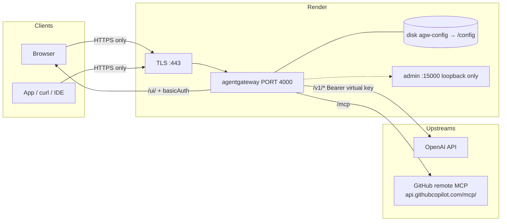

| Public path | Who it is for | Auth |
|-------------|----------------|------|
| `/ui/` | Operators | HTTP basic (`UI_USER` / `UI_PASSWORD`) |
| `/v1/*` | Apps, playground, `curl` | `llm.policies.apiKey` **strict** — Bearer virtual key |
| `/mcp` | MCP clients | Optional. GitHub PAT on the upstream target when seeded |

`ui.policies` does **not** cover `/v1/*`. Do not send the UI password as an LLM Bearer token.

## Live lab (placeholders only)

| Fact | Value |
|------|--------|
| Service | `agentgateway-standalone` (Web Service, Docker, **0.5c-512mb**) |
| URL | https://agentgateway-standalone.onrender.com — **HTTPS only** |
| Dashboard | https://dashboard.render.com/web/srv-daf2208n74is73fvr090 |
| Disk | **`agw-config`** → **`/config`**, 1 GB |
| UI | `/ui/` basic auth via `UI_USER` + `UI_PASSWORD` |
| LLM | Optional OpenAI wildcard `*` on `/v1/*` |
| MCP | Optional GitHub remote Copilot MCP on `/mcp` (Streamable HTTP) |
| Admin | `:15000` on `127.0.0.1` — not on the internet |

Virtual API keys (`llm.policies.apiKey` `mode: strict`):

| Key (placeholder) | `metadata.name` | Models | Extra |
|-------------------|-----------------|--------|--------|
| `sk-lab-admin-...` | `admin` | any | — |
| `sk-lab-demo-...` | `demo` | selected models | — |
| `sk-lab-limited-...` | `limited` | `gpt-4.1-nano` | rolling token budget |

Rotate anything that ever leaked. The strings above are placeholders — they are not the live secrets.

Example config (same shape as [`config.example.yaml`](./config.example.yaml)):

```yaml
llm:
  policies:
    apiKey:
      mode: strict
      keys:
      - key: sk-lab-admin-...
        metadata: { name: admin }
      - key: sk-lab-demo-...
        metadata: { name: demo }
        allowedModels: [gpt-4.1-nano, gpt-4.1, gpt-4o]
      - key: sk-lab-limited-...
        metadata: { name: limited }
        allowedModels: [gpt-4.1-nano]
        budgets:
        - name: tokens
          limit: { unit: Tokens, amount: 1000 }
          window: { rolling: 1h }
          onBudgetExceeded: Block
```

A `GET /v1/models` with no `Authorization` header returns `api key authentication failure: no API Key found`. That is the strict policy working.

## Environment variables

Set these in the Render **Environment** tab. Never commit real values. See [`.env.example`](./.env.example).

| Variable | Required | Purpose |
|----------|----------|---------|
| `PORT` | **Yes** | Must be `4000`. Render proxies `$PORT` (default `10000`); the gateway listens on 4000. |
| `UI_USER` | No | Basic-auth username. Default `admin`. |
| `UI_PASSWORD` | **Yes** | Entrypoint writes `/config/.htpasswd` every start. Process exits 1 if unset. |
| `OPENAI_API_KEY` | No | Optional. Not prompted on Blueprint create. Set later to seed the OpenAI wildcard (`$OPENAI_API_KEY` on the model). |
| `ANTHROPIC_API_KEY` | No | Optional. Not seeded. Add a model in the UI if you use Anthropic. |
| `GITHUB_PERSONAL_ACCESS_TOKEN` | No | Optional. Not prompted on Blueprint create. Set later to seed GitHub remote MCP (`$GITHUB_PERSONAL_ACCESS_TOKEN` on the target). |

## How to

### 1. Create the Render web service

**Button / Blueprint** — prefer this folder’s Blueprint:

[](https://render.com/deploy?repo=https://github.com/sebbycorp/agentgateway-demos&path=34-render-deploy-agw/render.yaml)

- One-click URL uses `path=34-render-deploy-agw/render.yaml` (required when the file is not at repo root).
- Dashboard: **Blueprint Path** = `34-render-deploy-agw/render.yaml`.
- File: [`render.yaml`](./render.yaml). Root / `deploy/` copies stay in sync for callers that still expect `/render.yaml`.

**Manual** — New → Web Service → this repo, Docker, `./deploy/Dockerfile`, context `./deploy`. Do **not** pick **Existing Image** → `cr.agentgateway.dev/agentgateway:v1.5.0`. Empty `/config` auto-gen serves `/ui/` with **no auth**.

Pushes to `main` auto-deploy when `deploy/` changes (`autoDeployTrigger: commit` + `buildFilter`). Other demo folders do not rebuild the lab.

### 2. Set the env vars

Render prompts only for `UI_PASSWORD` on first Blueprint create. Pin `PORT=4000`. Generate `UI_PASSWORD` in the dashboard. Provider keys (`OPENAI_API_KEY`, `ANTHROPIC_API_KEY`, `GITHUB_PERSONAL_ACCESS_TOKEN`) are optional — add them later in the Environment tab. The gateway exits if `config.yaml` expands a `$VAR` that is unset, so the entrypoint does not write those placeholders until the env var exists.

### 3. Disk

Blueprint already declares **`agw-config`** → **`/config`**, 1 GB. Disks are not available on Render Free — **0.5c-512mb** is the floor (Render still accepts `starter` as an alias). Without the volume, config and analytics reset on every deploy.

### 4. Deploy

First boot writes `.htpasswd` + a UI-only `config.yaml`. OpenAI (`llm`) and GitHub MCP are added only when those env vars are set. The gateway then watches `/config/config.yaml`. In Render logs you want:

- `entrypoint: seeded /config/config.yaml (ui basicAuth)` (first boot with only `UI_PASSWORD`), or `entrypoint: updated /config/config.yaml (uiAuth=… lab=… sanitize=…)` (old disk — `sanitize=true` drops leftover `$OPENAI_API_KEY` / empty `llm` so a missing provider key cannot crash the process)
- `state_manager Watching config file: /config/config.yaml`
- `app serving UI at http://localhost:4000/ui`
- `proxy::gateway started bind bind="bind/4000"`
- admin on `127.0.0.1:15000`
- `==> Your service is live`

If this service was created before the lab seed shipped, click **Manual Deploy**. The disk already has a config file, so a rebuild alone is not enough unless the entrypoint is allowed to merge missing `llm` / `mcp` sections (it will not overwrite models or MCP you added in the UI).

A `http.status=401` on `/ui/` with `basic authentication failure: no basic authentication credentials found` is success. Health checks must **not** `GET /ui/` (401 ≠ healthy). The Blueprint omits `healthCheckPath` so Render uses TCP on `:4000`.

### 5. Open the UI over HTTPS

```
https://<your-service>.onrender.com/ui/
```

Browser basic-auth prompt: `UI_USER` / `UI_PASSWORD`. Gateway Overview should show Traffic on gateway **default**. LLM and MCP counts depend on which optional keys you set.

### 6. Confirm OpenAI (optional)

Skip this if you did not set `OPENAI_API_KEY`. When that env var is present, the seed has incoming name `*`, provider OpenAI, API key `$OPENAI_API_KEY`. Add the key later in the Environment tab (Render restarts the service); if the disk still has no `llm.models`, the entrypoint merges the wildcard. **LLM → Models** should show the wildcard; outgoing model stays “Incoming model.” Only use **Add model** if you want a second provider.

### 7. Confirm virtual keys

When `OPENAI_API_KEY` is set, the seed is already **LLM → Virtual API Keys**, strict mode, three lab keys: `admin` (any), `demo` (selected models), `limited` (`gpt-4.1-nano` + token budget). Use placeholders in docs; paste real secrets only in the dashboard / disk. Without a provider key there is no `llm` section — add models in the UI later if you want.

### 8. Call chat completions (HTTPS + Bearer)

The playground’s wildcard row needs a **specific model** before Send is enabled (`gpt-4.1-nano` is what the live logs show). From a client:

```sh
export HOST=https://agentgateway-standalone.onrender.com
export VKEY='sk-lab-limited-...'   # placeholder — use your lab key

curl -sS "$HOST/v1/chat/completions" \
  -H "Authorization: Bearer $VKEY" \
  -H 'Content-Type: application/json' \
  -d '{
    "model": "gpt-4.1-nano",
    "messages": [{"role": "user", "content": "Reply with one word: pong"}]
  }'
```

A 200 with token usage shows up under **LLM → Logs**.

### 9. Confirm GitHub MCP (optional)

Skip this if you did not set `GITHUB_PERSONAL_ACCESS_TOKEN`. The seed attaches GitHub remote Copilot MCP only when that env var is present (no second public port). Add the token in the Environment tab later and restart: if the disk still has no `mcp` section, the entrypoint merges it.

```yaml
mcp:
  gateways: [default]
  targets:
  - name: github
    mcp:
      host: https://api.githubcopilot.com/mcp/
    policies:
      backendAuth:
        key:
          value: $GITHUB_PERSONAL_ACCESS_TOKEN
```

**MCP → Servers** should show `github`, Streamable HTTP, **ready**. Clients use `https://<your-service>.onrender.com/mcp`. Only use **Add server** for extra targets.

stdio MCP (`npx -y @modelcontextprotocol/server-everything`) is optional. The image on `main` already has Node/`npx` ([#19](https://github.com/sebbycorp/agentgateway-demos/pull/19)); still one public port — attach stdio targets to `default`.

## Screenshots

Live Render service and the agentgateway UI after OpenAI + GitHub MCP. Environment values are redacted in the dashboard.

### Render

**1. Services list** — Overview, `agentgateway-standalone` active (Docker, Oregon on this copy).

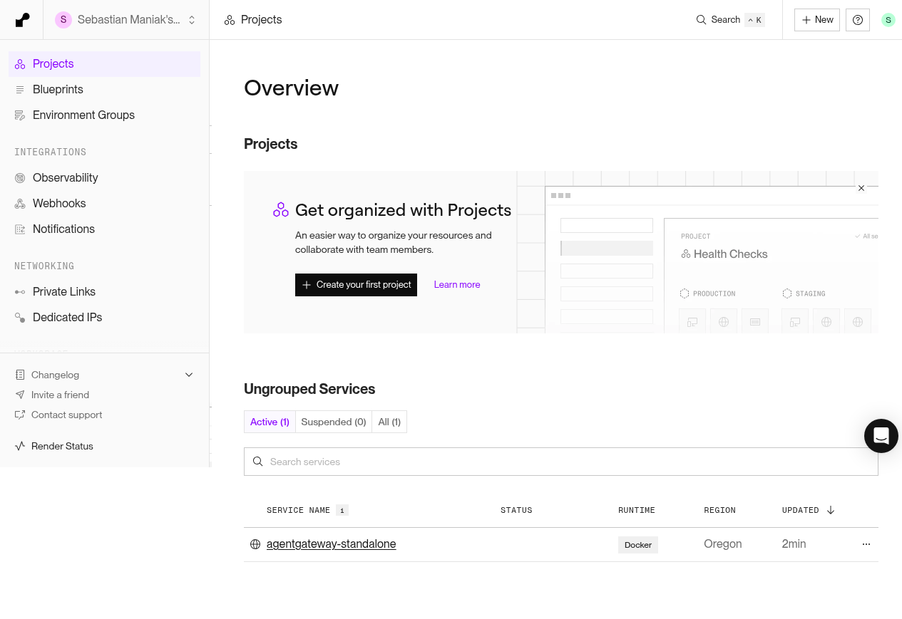

**2. Deploys** — Web Service, Docker, 0.5c-512mb. HTTPS URL `https://agentgateway-standalone.onrender.com`. Latest deploy `2cfc26c` (Node/`npx` in the image, #19).

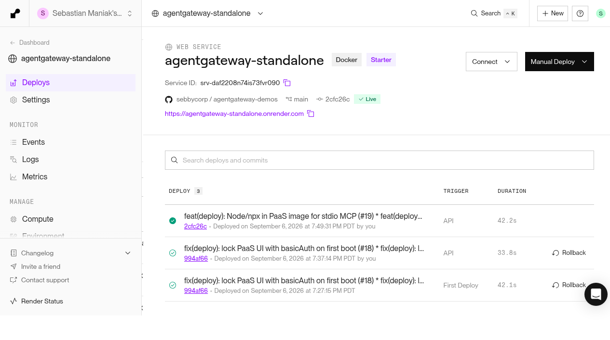

**3. Environment** — `PORT`, `UI_USER`, `UI_PASSWORD`. Optional `OPENAI_API_KEY`, `ANTHROPIC_API_KEY`, `GITHUB_PERSONAL_ACCESS_TOKEN`. Values hidden.

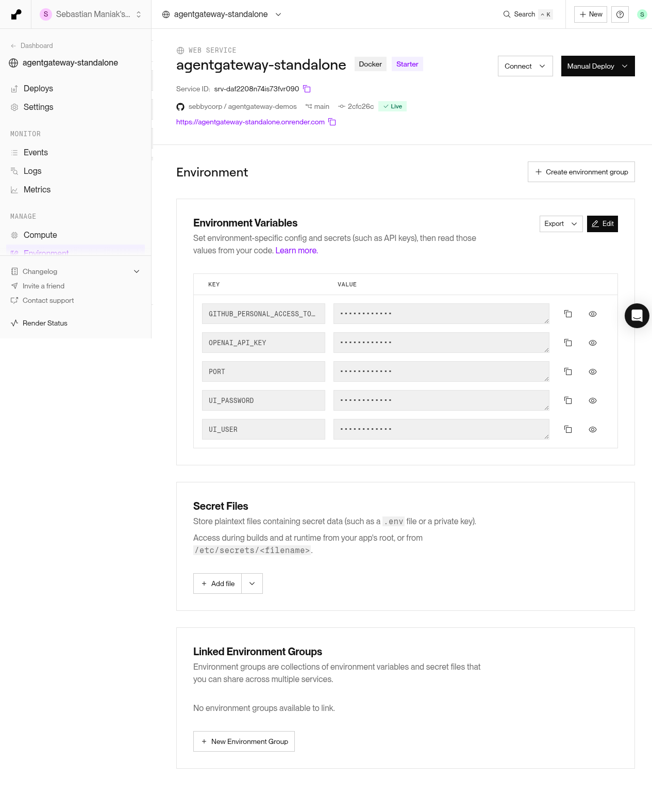

**4. Disk** — `agw-config`, 1 GB, mount `/config`.

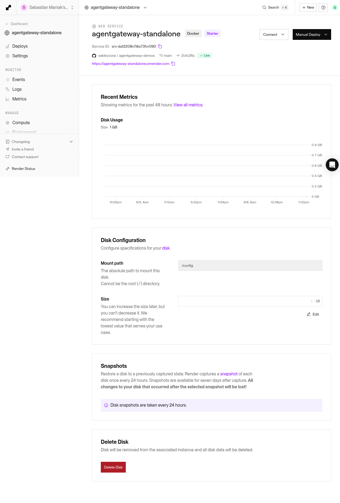

**5. Logs** — watch `/config/config.yaml`, UI on `:4000/ui`, admin on `127.0.0.1:15000`, bind `:4000`, then a 401 with no basic-auth credentials. Render: “Your service is live.”

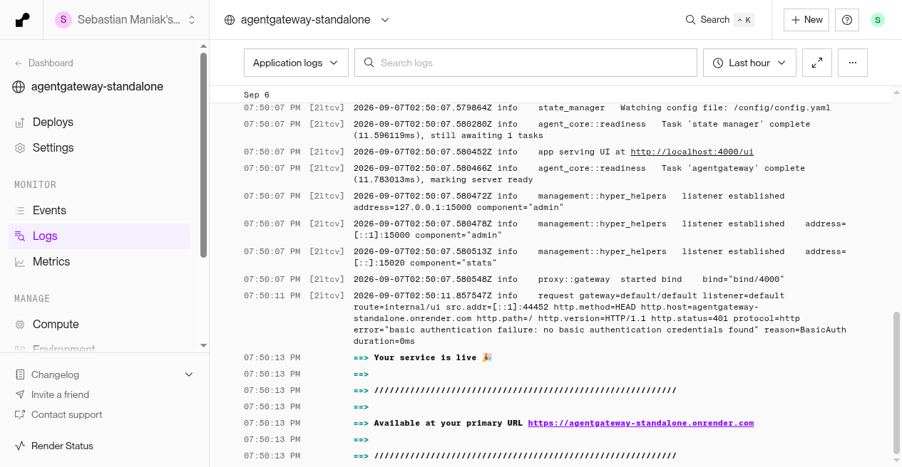

### agentgateway UI

**6. Gateway Overview** — LLM (1 model), MCP (1 server), Traffic (1 gateway), all on default.

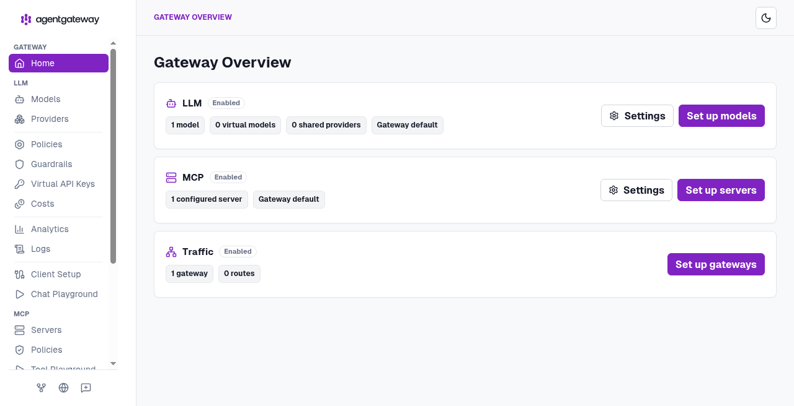

**7. LLM Models** — wildcard `*` → OpenAI, outgoing “Incoming model.”

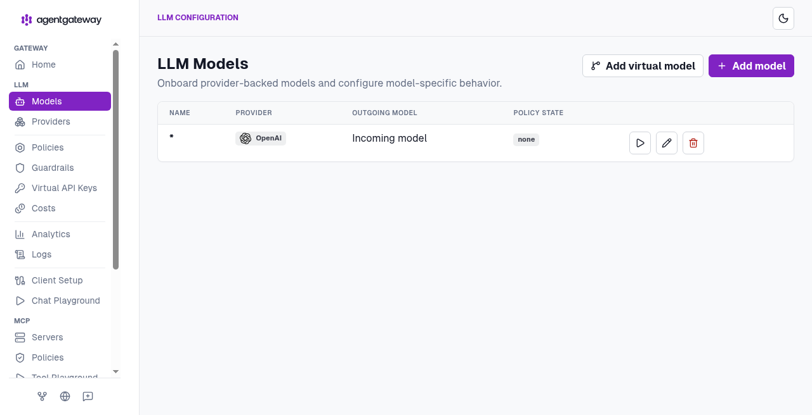

**8. MCP Servers** — `github`, Streamable HTTP, `https://api.githubcopilot.com/mcp/`, **ready**.

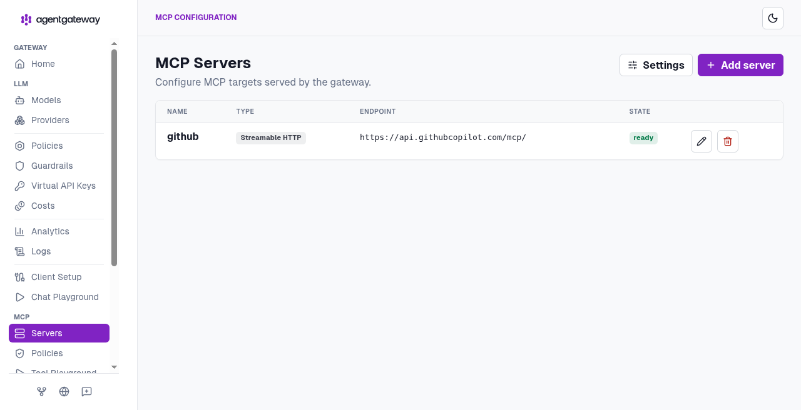

**9. Chat Playground** — model `*`, pick a concrete model, “Include MCP tools (1 server).”

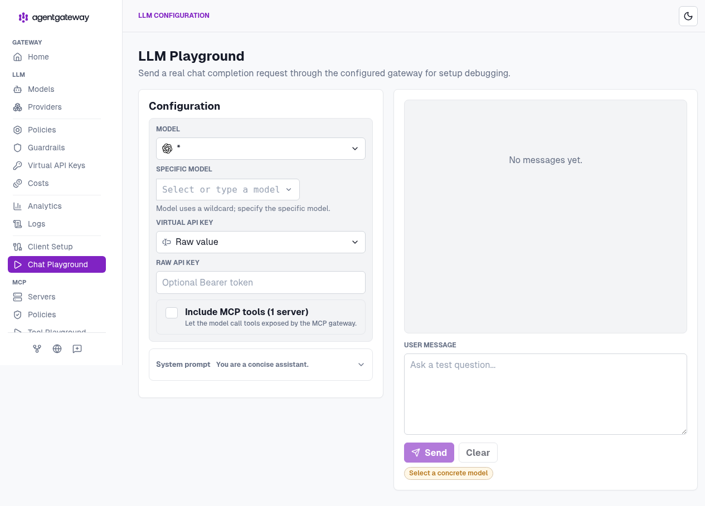

**10. LLM Logs** — `200` to `gpt-4.1-nano` (OpenAI → `gpt-4.1-nano-2025-04-14`), ~2s, 13 in / 5 out.

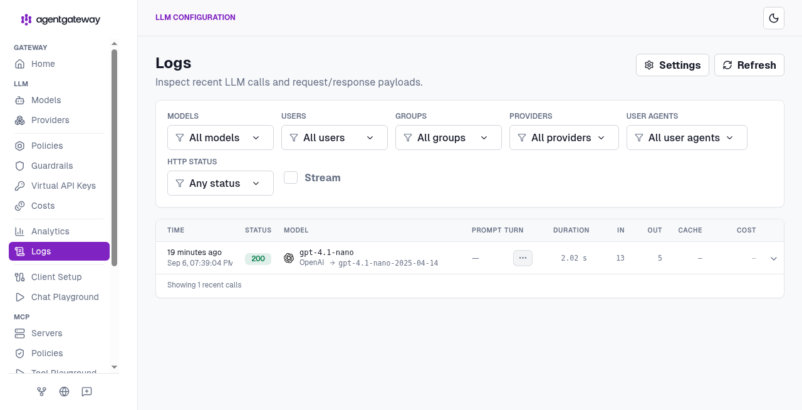

## Ports and limits

Render publishes **HTTPS :443** to one container port. That port is `4000`. There is no public `:4000` URL and no public admin.

| Address | Reachable from the internet? |
|---------|------------------------------|
| `https://<service>.onrender.com/ui/` | Yes, basic auth |
| `https://<service>.onrender.com/v1/*` | Yes, virtual API key |
| `https://<service>.onrender.com/mcp` | Yes, MCP |
| `http://<service>.onrender.com/...` | Do not use |
| `:4000` on the public hostname | Do not use |
| `:15000` | No — loopback only |

0.5c-512mb is enough for a demo. The disk is the persistence story.

## Security

`ui.policies.basicAuth` `mode: strict` plus file htpasswd (`{SHA}` lines the entrypoint rewrites every start). Unauthenticated `GET /ui/` is **401** and `WWW-Authenticate: Basic realm="agentgateway"`.

That is **demo-grade** behind Render TLS. It is not an IdP.

- Rotate `UI_PASSWORD`, `OPENAI_API_KEY`, `GITHUB_PERSONAL_ACCESS_TOKEN`, and every virtual key if this URL is more than a lab.
- Scope the GitHub PAT. Remote Copilot MCP will do whatever that token can do.
- `{SHA}` / HTTP basic is not SSO.

**OIDC is the production upgrade** when you share the URL past a short demo. It needs an IdP and `OIDC_COOKIE_SECRET` (32 random bytes as 64 hex chars). See [Secure the UI (OIDC)](https://agentgateway.dev/docs/standalone/latest/documentation/setup/ui/secure-ui/).

Inline bcrypt in `config.yaml` is a footgun: hashes contain `$`, and agentgateway env-expands `$VARS`. That is why the entrypoint uses a file.

## Verify

HTTPS only. Placeholders, not real secrets.

```sh
HOST=https://agentgateway-standalone.onrender.com
# or: HOST=https://<your-service>.onrender.com

# UI locked
curl -sI "$HOST/ui/" | grep -E 'HTTP/|www-authenticate'
# HTTP/2 401
# www-authenticate: Basic realm="agentgateway"

curl -sI -u "$UI_USER:$UI_PASSWORD" "$HOST/ui/" | head -5
# HTTP/2 200

# LLM requires a virtual key
curl -sS "$HOST/v1/models"
# api key authentication failure: no API Key found

curl -sS "$HOST/v1/models" -H "Authorization: Bearer sk-lab-admin-..."
curl -sS "$HOST/v1/chat/completions" \
  -H "Authorization: Bearer sk-lab-limited-..." \
  -H 'Content-Type: application/json' \
  -d '{"model":"gpt-4.1-nano","messages":[{"role":"user","content":"Reply with one word: pong"}]}'
# limited is gpt-4.1-nano + token budget — expect 429 budget_exceeded after the window fills

# MCP — GitHub remote (POST). Only if GITHUB_PERSONAL_ACCESS_TOKEN is set.
curl -sS "$HOST/mcp" \
  -H 'Content-Type: application/json' \
  -H 'Accept: application/json, text/event-stream' \
  -H 'mcp-protocol-version: 2025-06-18' \
  -d '{"jsonrpc":"2.0","id":1,"method":"initialize","params":{"protocolVersion":"2025-06-18","capabilities":{},"clientInfo":{"name":"howto","version":"1"}}}'
# look for serverInfo.name: github-mcp-server
```

A 401 on `/ui/` without credentials, a 200 with them, and a 401 on `/v1/models` without a Bearer key is the smoke test. If you set a GitHub PAT, an MCP `initialize` that names `github-mcp-server` is the extra check.

## What’s next

- **Everything MCP via `npx`** — attach a stdio target to `default` (still no second port). Image already has Node/`npx` after [#19](https://github.com/sebbycorp/agentgateway-demos/pull/19).
- **OIDC** — [Secure the UI](https://agentgateway.dev/docs/standalone/latest/documentation/setup/ui/secure-ui/).
- **Budgets** — deeper standalone key budgets live in [`16-api-key-scoped-token-budgets`](../16-api-key-scoped-token-budgets).

The container this lab builds is [`deploy/Dockerfile`](../deploy/Dockerfile) via Blueprint Path `34-render-deploy-agw/render.yaml`. This folder is the Render how-to.
